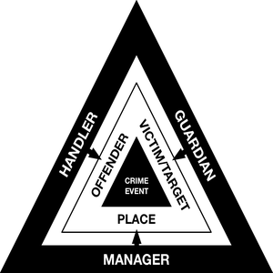

<!DOCTYPE html>
<html lang="en">
<!--
 <head>
  <meta charset="UTF-8">
  <meta name="viewport" content="width=device-width, initial-scale=1.0">
<title>FORENSICS</title>

</head>
-->
<body>

<h1>DIGITAL FORENSICS AND INCIDENT RESPONSE (DFIR)</h1>

<blockquote><h3>"These programs were never about terrorism: they're about economic spying, social control and diplomatic manipulation. They're about power." (Edward Snowden)</h3></blockquote>

<!-- ################################## -->

<h3>BASIC STRATEGY</h3>

<table style="width: 100%" cellspacing="0" cellpadding="0">
<thead>
  <tr>
  </tr>
</thead>
<tbody>
<tr>
  <td align="center" valign="top"><b>Crime Triangle</b></td>
  <td align="center" valign="top"><b>Basic Investigative Metodology</b></td>
</tr>
<tr>
  <td align="center" valign="top">
    
  </td>
  <td align="left" valign="top">
    

    <b>• 5W:</b> Who, What, When, Where and Why 
    <b>• PDCA Cycle:</b> Plan, Do, Check and Act 
    <b>• Root Cause Analysis (RCA):</b> 
    <ol>
    <li>Identify and describe the problem clearly</li>
    <li>Establish a timeline from the normal situation until  
    the problem occurs</li>
    <li>Distinguish between the root cause and other causal  
    factors (e.g., using event correlation)</li>
    <li>Establish a causal graph between the root cause 
    and the problem</li>
    </ol>
    

  </td>
</tr>
</tbody>
</table>

 

<h4>The criminal investigation must be protected from leaks by following a logical sequence:</h4>

<ol>
<li>Exhaust the data collection in open sources (OSINT) or closed sources (CSINT, AML Intelligence);</li>
<li>Hidden monitoring and tracking measures (SIGINT, HUMINT...);</li>
<li>With concrete evidence of the practices investigated and exhaustion of remote possibilities, launch the operation itself with the publication of the investigation. At this stage, search and seizure warrants, temporary or preventive arrest and statements will be taken.</li>
</ol>

<!-- ################################## -->
 

<h3>FORENSIC SUITES</h3>

<table style="width: 100%" cellspacing="0" cellpadding="0">
<thead>
  <tr>
  </tr>
</thead>
<tbody>
<tr>
<td align="center" valign="top" style="width: 50%"><b>FLOSS</b> Free/Libre and Open Source Software</td>
<td align="center" valign="top" style="width: 50%"><b>PROPRIETARY</b> Cyber-surveillance Industry</td>
</tr>
<tr>
<td align="left" valign="top" style="width: 50%">
• Drive Badger <a href="https://drivebadger.com">https://drivebadger.com</a> <a href="https://github.com/drivebadger/drivebadger">(GitHub)</a> 
• SIFT Workstation <a href="https://sans.org/tools/sift-workstation" target="_blank" rel="noopener noreferrer">https://sans.org/tools/sift-workstation</a> 
• Parrot Security <a href="https://parrotsec.org">https://parrotsec.org</a> 
• Kali Linux <a href="https://kali.org">https://kali.org</a> 
• CAINE <a href="https://caine-live.net">https://caine-live.net</a> 
• CSI Linux <a href="https://csilinux.com">https://csilinux.com</a> 
• IPED Digital Forensic Tool <a href="https://github.com/sepinf-inc/IPED">https://github.com/sepinf-inc/IPED</a> 
• Avilla Forensics (Mobile Forensic) <a href="https://github.com/AvillaDaniel/AvillaForensics">https://github.com/AvillaDaniel/AvillaForensics</a> 
• Mobile Verification Toolkit (MVT) <a href="https://docs.mvt.re/en/latest">https://docs.mvt.re/en/latest</a> 
• Tsurugi Linux<a href="https://tsurugi-linux.org/"> https://tsurugi-linux.org/</a> 
• REMnux<a href="https://remnux.org/"> https://remnux.org</a> 
• Bitscout<a href="https://github.com/vitaly-kamluk/bitscout"> https://github.com/vitaly-kamluk/bitscout</a> 
• Debian Forensics Packages <a href="https://packages.debian.org/unstable/forensics-all">https://packages.debian.org/unstable/forensics-all</a> 
• Eric Zimmerman's tools (Freeware) <a href="https://ericzimmerman.github.io/#!index.md">https://ericzimmerman.github.io/#!index.md</a> 
• Paladin® (Freeware) <a href="https://sumuri.com/product/paladin-lts/">https://sumuri.com/software/paladin/</a> 
• Forensic Toolkit (FTK)® - Lite (Freeware)  <a href="https://exterro.com/ftk-product-downloads/how-to-run-ftk-imager-from-a-flash-drive-imager-lite" target="_blank" rel="noopener noreferrer">https://exterro.com/forensic-toolkit</a> 
• Magnet Forensic® - Mobile Extractor (Freeware) <a href="https://magnetforensics.com/" target="_blank" rel="noopener noreferrer">https://magnetforensics.com</a> 
• Windows® Forensic Environment WinFE (Freeware) <a href="https://winfe.net/home" target="_blank" rel="noopener noreferrer">https://winfe.net</a> 
• NirSoft® (Freeware) <a href="https://nirsoft.net/computer_forensic_software.html">https://nirsoft.net</a> 
• MiTeC® (Freeware) <a href="https://mitec.cz">https://mitec.cz</a> 
• Medusa Box® (Easy J-TAG)  <a href="https://medusabox.com/">https://medusabox.com</a>  ╰┈➤<a href="https://medusabox.com/eng/features/features">Models Features</a>  ╰┈➤<a href="https://aliexpress.com/w/wholesale-medusa-box.html">Aliexpress</a> 
• Octoplus Box® (Easy J-TAG) <a href="https://octoplusbox.com">https://octoplusbox.com</a>  ╰┈➤<a href="https://octoplusbox.com/en/features/models/">Models Features</a>  ╰┈➤<a href="https://aliexpress.com/w/wholesale-octoplus-box.html">Aliexpress</a> 
</td>
<td align="left" valign="top" style="width: 50%;">
• Cellebrite® <a href="https://cellebrite.com/" target="_blank" rel="noopener noreferrer">https://cellebrite.com</a> 
• NSO Group® <a href="https://nsogroup.com/" target="_blank" rel="noopener noreferrer">https://nsogroup.com</a> 
• Cognyte® <a href="https://cognyte.com/" target="_blank" rel="noopener noreferrer">https://cognyte.com</a> 
• Check Point® <a href="https://checkpoint.com" target="_blank" rel="noopener noreferrer">https://checkpoint.com</a> 
• Team Cymru® <a href="https://team-cymru.com" target="_blank" rel="noopener noreferrer">https://team-cymru.com</a> 
• BriefCam® <a href="https://briefcam.com/" target="_blank" rel="noopener noreferrer">https://briefcam.com/</a> 
• Forensic Toolkit (FTK)®  <a href="https://exterro.com/forensic-toolkit" target="_blank" rel="noopener noreferrer">https://exterro.com/forensic-toolkit</a> 
• Magnet Forensic® <a href="https://magnetforensics.com/" target="_blank" rel="noopener noreferrer">https://magnetforensics.com</a> 
• Variston® <a href="https://variston.net" target="_blank" rel="noopener noreferrer">https://variston.net</a> 
• Intellexa® <a href=no refer" target="_blank" rel="noopener noreferrer">no refer</a> 
• Cytrox® <a href="no refer" target="_blank" rel="noopener noreferrer">no refer</a> 
• Cy4Gate® <a href="https://cy4gate.com/" target="_blank" rel="noopener noreferrer">https://cy4gate.com/</a> 
• PARS Defense® <a href="https://parsdefense.com" target="_blank" rel="noopener noreferrer">https://parsdefense.com</a> 
• Candiru® <a href="https://saito.tech" target="_blank" rel="noopener noreferrer">https://saito.tech/</a> 
• Harpia Tech® <a href="https://harpia.tech/english.html" target="_blank" rel="noopener noreferrer">https://harpia.tech</a> 
• Visual Cortex® <a href="https://visualcortex.com/" target="_blank" rel="noopener noreferrer">https://visualcortex.com</a> 
• Oxygen Forensic® <a href="https://oxygen-forensic.wedatasolution.com/" target="_blank" rel="noopener noreferrer">https://oxygen-forensic.wedatasolution.com</a> 
• MSAB® <a href="https://msab.com/" target="_blank" rel="noopener noreferrer">https://msab.com</a> 
• GMDSOFT® <a href="https://gmdsoft.com/" target="_blank" rel="noopener noreferrer">https://gmdsoft.com</a> 
• Verint Systems® <a href="https://verint.com/" target="_blank" rel="noopener noreferrer">https://verint.com</a> 
• Cyber Arm® <a href="https://cyber-arm.com/services" target="_blank" rel="noopener noreferrer">https://cyber-arm.com/services</a> 
• Cobalt Strike® <a href="https://cobaltstrike.com" target="_blank" rel="noopener noreferrer">https://cobaltstrike.com</a> 
• Lumi Networks® <a href="https://lumi.network" target="_blank" rel="noopener noreferrer">https://lumi.network</a> 
• Clear View AI® <a href="https://clearview.ai" target="_blank" rel="noopener noreferrer">https://clearview.ai</a> 
• Lockheed Martin® <a href="https://lockheedmartin.com" target="_blank" rel="noopener noreferrer">https://lockheedmartin.com/</a> 
• MOBILedit® <a href="https://mobiledit.com/mobiledit-forensic" target="_blank" rel="noopener noreferrer">https://mobiledit.com</a> 
• Crowd Strike® <a href="https://crowdstrike.com" target="_blank" rel="noopener noreferrer">https://crowdstrike.com</a> 
• Binalyze® <a href="https://binalyze.com" target="_blank" rel="noopener noreferrer">https://binalyze.com</a> 
• LexisNexis® <a href="https://risk.lexisnexis.com" target="_blank" rel="noopener noreferrer">https://risk.lexisnexis.com</a> 
• NetQuest® <a href="https://netquestcorp.com" target="_blank" rel="noopener noreferrer">https://netquestcorp.com</a> 
• Gamma® <a href="https://gamma.co.uk" target="_blank" rel="noopener noreferrer">https://gamma.co.uk</a> 
• Memento Labs® <a href="https://mem3nt0.com" target="_blank" rel="noopener noreferrer">https://mem3nt0.com</a> 
• CYSource® <a href="https://cysrc.com" target="_blank" rel="noopener noreferrer">https://cysrc.com</a> 
• Maltego® <a href="https://maltego.com" target="_blank" rel="noopener noreferrer">https://maltego.com</a> 
• Thorn's Safer® <a href="https://thorn.org/" target="_blank" rel="noopener noreferrer">https://thorn.org</a> 
</td>
</tr>
</tbody>
</table>
Browse: https://dimse.info

<!-- ################################## -->

<h3>FORENSIC TOOLS</h3>

<h4>• Evidence ProjectForensics Tools Catalogue</h4>
<h4><a href="https://dftoolscatalogue.eu/dftc.home.php">https://dftoolscatalogue.eu</a></h4>

<h4>• NIST - Forensics Tools Catalogue</h4>
<h4><a href="https://toolcatalog.nist.gov/search/">https://toolcatalog.nist.gov</a></h4>

<h4>• S&T partners and NIST - Computer Forensic Tool Testing (CFTT)</h4>
<h4><a href="https://dhs.gov/science-and-technology/nist-cftt-reports">https://dhs.gov/science-and-technology/nist-cftt-reports</a></h4>

<!-- ################################## -->

<b>Interesting information</b>

<a href="https://socradar.io/beyond-the-veil-of-surveillance-private-sector-offensive-actors-psoas">• Beyond the Veil of Surveillance: Private Sector Offensive Actors (PSOAs)</a>

<a href="https://zdnet.com/article/burn-drown-or-smash-your-phone-forensics-can-extract-data-anyway">• Burn, drown, or smash your phone: Forensics can extract data anyway</a>

<a href="https://arstechnica.com/information-technology/2021/01/how-law-enforcement-gets-around-your-smartphones-encryption">• How law enforcement gets around your smartphone’s encryption</a>

<a href="https://youtube.com/watch?v=EmWsW_p_ta4">• Cellphone data used to solve murder case from 2 years ago, police say</a>

<a href="https://youtube.com/watch?v=wzSgLpNrr2E">• The Stingray: How Law Enforcement Can Track Your Every Move</a>

<a href="https://youtube.com/watch?v=DH7edXaZS0A">• Police are tracking you and your license plates</a>

<a href="https://youtube.com/watch?v=ASYm-3NJ-GA&t=40s">• SCOTUS: Police Need Search Warrant to Ping cell Phones</a>

<a href="https://eff.org/deeplinks/2023/09/eff-michigan-court-governments-shouldnt-be-allowed-use-drone-spy-you-without">• EFF to Michigan Court: Governments Shouldn’t Be Allowed to Use a Drone to Spy on You Without a Warrant</a>

<a href="https://theintercept.com/document/motion-to-suppress-aerial-surveillance-evidence-in-u-s-vs-muhammed-momtaz-alazhari">• Motion to Suppress Aerial Surveillance Evidence in U.S. vs Muhammed Momtaz Alazhari</a>

<a href="https://nytimes.com/2008/02/22/technology/22chip.html">• Researchers Find Way to Steal Encrypted Data - NYT (2008)</a>

<a href="https://nakedcapitalism.com/2019/02/reverse-location-search-warrant-a-new-personal-data-hoovering-exercise-brought-to-you-by-google.html">• “Reverse Location Search Warrant”: A New Personal Data Hoovering Exercise Brought to You by Google (2019)</a>

<a href="https://nakedcapitalism.com/2021/07/as-un-human-rights-chief-urges-stricter-rules-snowden-calls-for-end-to-spyware-trade.html">• As UN Human Rights Chief Urges Stricter Rules, Snowden Calls for End to Spyware Trade (2021)</a>

<a href="https://forensicscijournal.com/articles/jfsr-aid1039.pdf">• Forensics Journal Comparative analysis of mobile forensic proprietary tools: an application in forensic investigation (2022)</a>

<!-- ################################## -->
 

<h3>INTERCEPTION PLATFORMS</h3>

Comparison between <a href="https://drivebadger.com">Drive Badger</a> <a href="https://github.com/drivebadger/drivebadger">(GitHub)</a> with other lawful interception platforms. Visit: <a href="https://docs.google.com/spreadsheets/d/1Ux0WeL-K4NOZTEQgJXuRzHPcG_ewKmcMNADuFhamytg/edit#gid=1460165261" target="_blank" rel="noopener noreferrer">Official sheet</a> or the <a href="https://github.com/RENANZG/My-Forensics/blob/main/03_DOCUMENTS/Workrounds/Drive_Bagder_-_Comparison_Of_Lawful_Interception_Platforms.pdf" target="_blank" rel="noopener noreferrer">PDF</a> version in our repo. Credits for the panel: <a href="https://github.com/tomaszklim">Tomasz Klim</a>.

<!-- ################################## -->

 

<h3>Exploit and Spyware Vendor</h3>

<table>
<tbody>
<tr>
<td>
<strong>Zero-day Exploit (2023)</strong>
</td>
<td>
<strong>Associated Spyware Vendor</strong>
</td>
</tr>
<tr>
<td>
<a href="https://thehackernews.com/2023/04/apple-releases-updates-to-address-zero.html">CVE-2023-28205 and CVE-2023-28206</a> (Apple iOS)
</td>
<td>
Variston (BridgeHead)
</td>
</tr>
<tr>
<td>
<a href="https://thehackernews.com/2023/04/google-releases-urgent-chrome-update-to.html">CVE-2023-2033</a> (Google Chrome)
</td>
<td>
Intellexa/Cytrox (Predator)
</td>
</tr>
<tr>
<td>
<a href="https://thehackernews.com/2023/04/google-chrome-hit-by-second-zero-day.html">CVE-2023-2136</a> (Google Chrome)
</td>
<td>
Intellexa/Cytrox (Predator)
</td>
</tr>
<tr>
<td>
<a href="https://thehackernews.com/2023/05/webkit-under-attack-apple-issues.html">CVE-2023-32409</a> (Apple iOS)
</td>
<td>
Variston (BridgeHead)
</td>
</tr>
<tr>
<td>
<a href="https://thehackernews.com/2023/06/zero-day-alert-google-issues-patch-for.html">CVE-2023-3079</a> (Google Chrome)
</td>
<td>
Intellexa/Cytrox (Predator)
</td>
</tr>
<tr>
<td>
<a href="https://thehackernews.com/2023/09/apple-rushes-to-patch-zero-day-flaws.html">CVE-2023-41061 and CVE-2023-41064</a> (Apple iOS)
</td>
<td>
NSO Group (Pegasus)
</td>
</tr>
<tr>
<td>
<a href="https://thehackernews.com/2023/09/apple-rushes-to-patch-3-new-zero-day.html">CVE-2023-41991, CVE-2023-41992, and CVE-2023-41993</a> (Apple iOS)
</td>
<td>
Intellexa/Cytrox (Predator)
</td>
</tr>
<tr>
<td>
<a href="https://thehackernews.com/2023/09/update-chrome-now-google-releases-patch.html">CVE-2023-5217</a> (Google Chrome)
</td>
<td>
Candiru (DevilsTongue)
</td>
</tr>
<tr>
<td>
<a href="https://thehackernews.com/2023/10/arm-issues-patch-for-mali-gpu-kernel.html">CVE-2023-4211</a> (Arm Mali GPU)
</td>
<td>
Cy4Gate (Epeius)
</td>
</tr>
<tr>
<td>
<a href="https://thehackernews.com/2023/10/qualcomm-releases-patch-for-3-new-zero.html">CVE-2023-33063</a> (Qualcomm Adreno GPU)
</td>
<td>
Variston (BridgeHead)
</td>
</tr>
<tr>
<td>
<a href="https://thehackernews.com/2023/10/qualcomm-releases-patch-for-3-new-zero.html">CVE-2023-33106 and CVE-2023-33107</a> (Qualcomm Adreno GPU)
</td>
<td>
Cy4Gate (Epeius)
</td>
</tr>
<tr>
<td>
<a href="https://thehackernews.com/2023/12/zero-day-alert-apple-rolls-out-ios.html">CVE-2023-42916 and CVE-2023-42917</a> (Apple iOS)
</td>
<td>
PARS Defense
</td>
</tr>
<tr>
<td>
<a href="https://thehackernews.com/2023/12/urgent-new-chrome-zero-day.html">CVE-2023-7024</a> (Google Chrome)
</td>
<td>
NSO Group (Pegasus)
</td>
</tr>
</tbody>
</table>

<!-- ################################## -->

 

<h3>NATIONAL CYBER SECURITY AGENCIES</h3>

<table style="width:830px" cellspacing="0" cellpadding="0">
<thead>
  <tr>
  </tr>
</thead>
<tbody>
<tr>
<td valign="top" style="width:25%">
<a href="https://cisa.gov/">US — CISA</a> 
<a href="https://cyber.gc.ca/en">CA — Cyber</a> 
<a href="https://csirtamericas.org/en">Americas — CSIRT</a> 
</td>
<td valign="top" style="width:25%">
<a href="https://enisa.europa.eu">EU — ENISA</a> 
<a href="https://ncsc.gov.uk">UK — NCSC</a> 
<a href="https://english.ncsc.nl">NL — NCSC</a> 
<a href="https://bsi.bund.de/EN">DE — BSI</a> 
<a href="https://cyber.gouv.fr/en">FR — ANSSI</a> 
<a href="https://ccn-cert.cni.es/es/">ES — CCN-CERT</a> 
<a href="https://acn.gov.it/en">IT — ACN</a> 
<a href="https://nki.gov.hu/en">HU — NKI</a> 
<a href="https://nukib.cz/en">CZ — NUKIB</a> 
<a href="https://nsm.no/areas-of-expertise/cyber-securitynorwegian-national-cyber-security-centre-ncsc">NO — NCSC</a> 
</td>
<td valign="top" style="width:25%">
<a href="https://gov.il/en/departments/israel_national_cyber_directorate/govil-landing-page">IS — INCD</a> 
<a href="https://cyber.gov.au">AU — Cyber</a> 
<a href="https://cert.govt.nz">NZ — CERT</a> 
<a href="https://ncsc.govt.nz">NZ — NCSC</a> 
</td>
<td valign="top" style="width:25%">
<a href="https://kisa.or.kr/EN">KR — KISA</a> 
<a href="https://jpcert.or.jp/english">JP — Cert</a> 
<a href="https://nisc.go.jp/eng/index.html">JP — NISC</a> 
<a href="https://csa.gov.sg">SG — CSA</a> 
</td>
</tr>
</tbody>
</table>

<!-- ############################## -->

 

${\color{Blue}\textbf{1.PASSIVE FORENSICS}}$

👷🛠️UNDER CONSTRUCTION🚧🏗 

1.01 Forensic standards

 

Visit our repo tree: <a href="https://github.com/RENANZG/My-Forensics/tree/main/2.FORENSIC">2.FORENSIC</a>

<b>Standards</b>

 

<h4>NIST — National Institute of Standards and Technology</h4>

<h6>Visit: https://nist.gov/standards</h6>

<h4>ASTM International</h4>

<h5>Subcommittee E30.12 on Digital and Multimedia Evidence</h5>

<h6>Visit: https://www.astm.org/get-involved/technical-committees/committee-e30/subcommittee-e30/jurisdiction-e3012</h6>

<h4>The PCI Security Standards Council (PCI SSC)</h4>

<h6>Visit: https://www.pcisecuritystandards.org</h6>

<b>ISO/IEC — International Electrotechnical Commission</b>

<h6>Visit: https://iso27001security.com</h6>

<h6>Official - Information security, cybersecurity and privacy protection — https://iso.org/standard/27001</h6>

<ul>
<li><A HREF="https://iso27001security.com/html/27000.html">ISO/IEC 27000 — ISO27k overview &amp; glossary</a></li>
<li><A HREF="https://iso27001security.com/html/27001.html">ISO/IEC 27001 — formal ISMS specification</a></li>
<li><A HREF="https://iso27001security.com/html/27002.html">ISO/IEC 27002 — infosec controls catalogue</a></li>
<li><A HREF="https://iso27001security.com/html/27003.html">ISO/IEC 27003 — ISMS implementation guide</a></li>
<li><A HREF="https://iso27001security.com/html/27004.html">ISO/IEC 27004 — infosec measurement [metrics]</a></li>
<li><A HREF="https://iso27001security.com/html/27005.html">ISO/IEC 27005 — info[sec] risk management</a></li>
<li><A HREF="https://iso27001security.com/html/27006.html">ISO/IEC 27006-n — ISMS &amp; PIMS certification </a></li>
<li><A HREF="https://iso27001security.com/html/27007.html">ISO/IEC 27007 — <I>management system</I> auditing</a></li>
<li><A HREF="https://iso27001security.com/html/27008.html">ISO/IEC TS 27008 — <I>security controls</I> auditing</a></li>
<li><A HREF="https://iso27001security.com/html/27009.html">ISO/IEC 27009 — sector variants of ISO27k</a></li>
<li><A HREF="https://iso27001security.com/html/27010.html">ISO/IEC 27010 — for inter-org comms</a></li>
<li><A HREF="https://iso27001security.com/html/27011.html">ISO/IEC 27011 — ISMS for telecoms</a></li>
<li><A HREF="https://iso27001security.com/html/27013.html">ISO/IEC 27013 — ISMS &amp; ITIL/service mgmt</a></li>
<li><A HREF="https://iso27001security.com/html/27014.html">ISO/IEC 27014 — infosec governance</a></li>
<li><A HREF="https://iso27001security.com/html/27016.html">ISO/IEC TR 27016 — infosec economics</a></li>
<li><A HREF="https://iso27001security.com/html/27017.html">ISO/IEC 27017 — cloud security controls</a></li>
<li><A HREF="https://iso27001security.com/html/27018.html">ISO/IEC 27018 — cloud privacy</a></li>
<li><A HREF="https://iso27001security.com/html/27019.html">ISO/IEC 27019 — process control in energy industry</a></li>
<li><A HREF="https://iso27001security.com/html/27021.html">ISO/IEC 27021 — competences for ISMS pro&#8217;s</a></li>
<li><A HREF="https://iso27001security.com/html/27022.html">ISO/IEC TS 27022 — ISMS processes</a></li>
<li><A HREF="https://iso27001security.com/html/27031.html">ISO/IEC 27031 — ICT element of business continuity</a></li>
<li><A HREF="https://iso27001security.com/html/27032.html">ISO/IEC 27032 — Internet security</a></li>
<li><A HREF="https://iso27001security.com/html/27033.html">ISO/IEC 27033-n — network security</a></li>
<li><A HREF="https://iso27001security.com/html/27034.html">ISO/IEC 27034-n — application security</a></li>
<li><A HREF="https://iso27001security.com/html/27035.html">ISO/IEC 27035-n — incident management</a></li>
<li><A HREF="https://iso27001security.com/html/27036.html">ISO/IEC 27036-n — ICT supply chain &amp; cloud</a></li>
<li><A HREF="https://iso27001security.com/html/27037.html">ISO/IEC 27037 — digital evidence [eForensics]</a></li>
<li><A HREF="https://iso27001security.com/html/27038.html">ISO/IEC 27038 — document redaction</a></li>
<li><A HREF="https://iso27001security.com/html/27039.html">ISO/IEC 27039 — intrusion prevention</a></li>
<li><A HREF="https://iso27001security.com/html/27040.html">ISO/IEC 27040 — storage security</a></li>
<li><A HREF="https://iso27001security.com/html/27041.html">ISO/IEC 27041 — incident investigation assurance</a></li>
<li><A HREF="https://iso27001security.com/html/27042.html">ISO/IEC 27042 — analysing digital evidence</a></li>
<li><A HREF="https://iso27001security.com/html/27043.html">ISO/IEC 27043 — incident investigation</a></li>
<li><A HREF="https://iso27001security.com/html/27050.html">ISO/IEC 27050-n — digital forensics</a></li>
<li><A HREF="https://iso27001security.com/html/27070.html">ISO/IEC 27070 — virtual roots of trust</a></li>
<li><A HREF="https://iso27001security.com/html/27071.html">ISO/IEC 27071 — trusted connections</a></li>
<li><A HREF="https://iso27001security.com/html/27099.html">ISO/IEC 27099 — ISMS for PKI</a></li>
<li><A HREF="https://iso27001security.com/html/27100.html">ISO/IEC TS 27100 — cybersecurity overview/concepts</a></li>
<li><A HREF="https://iso27001security.com/html/27102.html">ISO/IEC 27102 — cyber-insurance</a></li>
<li><A HREF="https://iso27001security.com/html/27103.html">ISO/IEC 27103 —  ISMS for cybersecurity</a></li>
<li><A HREF="https://iso27001security.com/html/27110.html">ISO/IEC TS 27110 — cybersecurity frameworks</a></li>
<li><A HREF="https://iso27001security.com/html/27400.html">ISO/IEC 27400 — IoT security and privacy</a></li>
<li><A HREF="https://iso27001security.com/html/27550.html">ISO/IEC TR 27550 — privacy engineering</a></li>
<li><A HREF="https://iso27001security.com/html/27553.html">ISO/IEC 27553-n — mobile device biometrics</a></li>
<li><A HREF="https://iso27001security.com/html/27555.html">ISO/IEC 27555 — deleting PII/personal data</a></li>
<li><A HREF="https://iso27001security.com/html/27556.html">ISO/IEC 27556 — privacy preferences</a></li>
<li><A HREF="https://iso27001security.com/html/27557.html">ISO/IEC 27557 — privacy risk management</a></li>
<li><A HREF="https://iso27001security.com/html/27559.html">ISO/IEC 27559 — de-identification of personal data</a></li>
<li><A HREF="https://iso27001security.com/html/27560.html">ISO/IEC TS 27560 — privacy consent record structure</a></li>
<li><A HREF="https://iso27001security.com/html/27563.html">ISO/IEC TR 27563 — AI use case security &amp; privacy</a></li>
<li><A HREF="https://iso27001security.com/html/27570.html">ISO/IEC TS 27570 — smart city privacy</a></li>
<li><A HREF="https://iso27001security.com/html/27701.html">ISO/IEC 27701 — managing privacy with an ISMS</li>
<li><A HREF="https://iso27001security.com/html/27799.html">ISO 27799 — information security in healthcare</a></li>
</ul>

<b>RFC</b>

<b>Best Current Practices (BCP)</b>

<ul>
 <li><a href="https://ietf.org/rfc/rfc1918.txt"> RFC 1918 / BCP 5: Address Allocation for Private Internets</a></li>
 <li><a href="https://ietf.org/rfc/rfc2350.txt"> RFC 2350 / BCP 21: Expectations for Computer Security Incident Response</a></li>
 <li><a href="https://ietf.org/rfc/rfc2505.txt"> RFC 2505 / BCP 30: Anti-Spam Recommendations for SMTP MTAs</a></li>
 <li><a href="https://ietf.org/rfc/rfc2644.txt"> RFC 2644 / BCP 34: Changing the Default for Directed Broadcasts in Routers</a></li>
 <li><a href="https://ietf.org/rfc/rfc2827.txt"> RFC 2827 / BCP 38: Network Ingress Filtering: Defeating Denial of Service Attacks which employ IP Source Address Spoofing</a></li>
 <li><a href="https://ietf.org/rfc/rfc3013.txt"> RFC 3013 / BCP 46: Recommended Internet Service Provider Security Services and Procedures</a></li>
 <li><a href="https://ietf.org/rfc/rfc3227.txt"> RFC 3227 / BCP 55: Guidelines for Evidence Collection and Archiving</a></li>
 <li><a href="https://ietf.org/rfc/rfc3360.txt"> RFC 3360 / BCP 60: Inappropriate TCP Resets Considered Harmful</a></li>
 <li><a href="https://ietf.org/rfc/rfc3365.txt"> RFC 3365 / BCP 61: Strong Security Requirements for Internet Engineering Task Force Standard Protocols</a></li>
 <li><a href="https://ietf.org/rfc/rfc4086.txt"> RFC 4086 / BCP 106: Randomness Requirements for Security</a></li>
 <li><a href="https://ietf.org/rfc/rfc4107.txt"> RFC 4107 / BCP 107: Guidelines for Cryptographic Key Management</a></li>
 <li><a href="https://ietf.org/rfc/rfc5068.txt"> RFC 5068 / BCP 134: Email Submission Operations: Access and
Accountability Requirements</a></li>
<li><a href="https://ietf.org/rfc/rfc5358.txt">RFC 5358 / BCP 140: Preventing Use of Recursive Nameservers in Reflector Attacks</a></li>
<li><a href="https://ietf.org/rfc/rfc5406.txt">RFC 5406 / BCP 146: Guidelines for Specifying the Use of IPsec Version 2</a></li>
</ul>

<b>Standards</b>

<ul>
<li><a href="https://ietf.org/rfc/rfc2142.txt"> RFC 2142: Mailbox Names for Common Services, Roles and Functions</a></li>
<li><a href="https://ietf.org/rfc/rfc2246.txt"> RFC 2246: The TLS Protocol  Version 1.0</a></li>
<li><a href="https://ietf.org/rfc/rfc2554.txt"> RFC 2554: SMTP Service Extension for Authentication</a></li>
<li><a href="https://ietf.org/rfc/rfc3168.txt"> RFC 3168: The Addition of Explicit Congestion Notification (ECN) to IP</a></li>
<li><a href="https://ietf.org/rfc/rfc3207.txt"> RFC 3207: SMTP Service Extension for Secure SMTP over Transport Layer Security</a></li>
<li><a href="https://ietf.org/rfc/rfc3369.txt"> RFC 3369: Cryptographic Message Syntax (CMS)</a></li>
<li><a href="https://ietf.org/rfc/rfc3370.txt"> RFC 3370: Cryptographic Message Syntax (CMS) Algorithms</a></li>
<li><a href="https://ietf.org/rfc/rfc3834.txt"> RFC 3834: Recommendations for Automatic Responses to Electronic Mail</a></li>
<li><a href="https://ietf.org/rfc/rfc4033.txt"> RFC 4033: DNS Security Introduction and Requirements</a></li>
<li><a href="https://ietf.org/rfc/rfc4034.txt"> RFC 4034: Resource Records for the DNS Security Extensions</a></li>
<li><a href="https://ietf.org/rfc/rfc4035.txt"> RFC 4035: Protocol Modifications for the DNS Security Extensions</a></li>
<li><a href="https://ietf.org/rfc/rfc4051.txt"> RFC 4051: Additional XML Security Uniform Resource Identifiers (URIs)</a></li>
<li><a href="https://ietf.org/rfc/rfc4055.txt">RFC 4055: Additional Algorithms and Identifiers for RSA Cryptography for use in the Internet X.509 Public Key Infrastructure Certificate and Certificate Revocation List (CRL) Profile</a></li>
<li><a href="https://ietf.org/rfc/rfc4056.txt">RFC 4056: Use of the RSASSA-PSS Signature Algorithm in Cryptographic Message Syntax (CMS)</a></li>
<li><a href="https://ietf.org/rfc/rfc4109.txt">RFC 4109: Algorithms for Internet Key Exchange version 1 (IKEv1)</a></li>
<li><a href="https://ietf.org/rfc/rfc4217.txt">RFC 4217: Securing FTP with TLS</a></li>
<li><a href="https://ietf.org/rfc/rfc4250.txt">RFC 4250: The Secure Shell (SSH) Protocol Assigned Numbers</a></li>
<li><a href="https://ietf.org/rfc/rfc4251.txt">RFC 4251: The Secure Shell (SSH) Protocol Architecture</a></li>
<li><a href="https://ietf.org/rfc/rfc4252.txt">RFC 4252: The Secure Shell (SSH) Authentication Protocol</a></li>
<li><a href="https://ietf.org/rfc/rfc4253.txt">RFC 4253: The Secure Shell (SSH) Transport Layer Protocol</a></li>
<li><a href="https://ietf.org/rfc/rfc4254.txt">RFC 4254: The Secure Shell (SSH) Connection Protocol</a></li>
<li><a href="https://ietf.org/rfc/rfc4255.txt">RFC 4255: Using DNS to Securely Publish Secure Shell (SSH) Key Fingerprints</a></li>
<li><a href="https://ietf.org/rfc/rfc4256.txt">RFC 4256: Generic Message Exchange Authentication for the Secure Shell Protocol (SSH)</a></li>
<li><a href="https://ietf.org/rfc/rfc4301.txt">RFC 4301: Security Architecture for the Internet Protocol</a></li>
<li><a href="https://ietf.org/rfc/rfc4302.txt">RFC 4302: IP Authentication Header</a></li>
<li><a href="https://ietf.org/rfc/rfc4303.txt">RFC 4303: IP Encapsulating Security Payload (ESP)</a></li>
<li><a href="https://ietf.org/rfc/rfc4308.txt">RFC 4308: Cryptographic Suites for IPsec</a></li>
<li><a href="https://ietf.org/rfc/rfc4344.txt">RFC 4344: The Secure Shell (SSH) Transport Layer Encryption Modes</a></li>
<li><a href="https://ietf.org/rfc/rfc4346.txt">RFC 4346: The Transport Layer Security (TLS) Protocol Version 1.1</a></li>
<li><a href="https://ietf.org/rfc/rfc4359.txt">RFC 4359: The Use of RSA/SHA-1 Signatures within Encapsulating
Security Payload (ESP) and Authentication Header (AH)</a></li>
<li><a href="https://ietf.org/rfc/rfc4366.txt">RFC 4366: Transport Layer Security (TLS) Extensions</a></li>
<li><a href="https://ietf.org/rfc/rfc4513.txt">RFC 4513: Lightweight Directory Access Protocol (LDAP): Authentication Methods and Security Mechanisms</a></li>
<li><a href="https://ietf.org/rfc/rfc4871.txt">RFC 4871: DomainKeys Identified Mail (DKIM) Signatures</a></li>
<li><a href="https://ietf.org/rfc/rfc4959.txt">RFC 4959: IMAP Extension for Simple Authentication and Security Layer (SASL) Initial Client Response</a></li>
<li><a href="https://ietf.org/rfc/rfc4985.txt">RFC 4985: Internet X.509 Public Key Infrastructure Subject Alternative Name for Expression of Service Name</a></li>
<li><a href="https://ietf.org/rfc/rfc5070.txt">RFC 5070: The Incident Object Description Exchange Format</a></li>
<li><a href="https://ietf.org/rfc/rfc5321.txt">RFC 5321: Simple Mail Transfer Protocol</a></li>
<li><a href="https://ietf.org/rfc/rfc5322.txt">RFC 5322: Internet Message Format</a></li>
<li><a href="https://ietf.org/rfc/rfc5901.txt">RFC 5901: Extensions to the IODEF-Document Class for Reporting Phishing</a></li>
<li><a href="https://ietf.org/rfc/rfc6045.txt">RFC 6045: Real-time Inter-network Defense (RID)</a></li>
<li><a href="https://ietf.org/rfc/rfc6409.txt">RFC 6409: Message Submission for Mail</a></li>
<li><a href="https://ietf.org/rfc/rfc6528.txt">RFC 6528: Defending against Sequence Number Attacks</a></li>
</ul>

<b>Informational</b>

<ul>
 <li><a href="https://ietf.org/rfc/rfc1281.txt"> RFC 1281: Guidelines for the Secure Operation of the Internet</a></li>
 <li><a href="https://ietf.org/rfc/rfc1321.txt"> RFC 1321: The MD5 Message-Digest Algorithm</a></li>
 <li><a href="https://ietf.org/rfc/rfc1470.txt"> RFC 1470: Tools for Monitoring and Debugging TCP/IP Internets and Interconnected Devices</a></li>
 <li><a href="https://ietf.org/rfc/rfc1750.txt"> RFC 1750: Randomness Recommendations for Security</a></li>
 <li><a href="https://ietf.org/rfc/rfc2076.txt"> RFC 2076: Common Internet Message Headers</a></li>
 <li><a href="https://ietf.org/rfc/rfc2196.txt"> RFC 2196: Site Security Handbook</a></li>
 <li><a href="https://ietf.org/rfc/rfc2411.txt"> RFC 2411: IP Security Document Roadmap</a></li>
 <li><a href="https://ietf.org/rfc/rfc2504.txt"> RFC 2504: Users Security Handbook</a></li>
 <li><a href="https://ietf.org/rfc/rfc2577.txt"> RFC 2577: FTP Security Considerations</a></li>
 <li><a href="https://ietf.org/rfc/rfc2979.txt"> RFC 2979: Behavior of and Requirements for Internet Firewalls</a></li>
 <li><a href="https://ietf.org/rfc/rfc3067.txt"> RFC 3067: TERENA's Incident Object Description and Exchange Format Requirements</a></li>
 <li><a href="https://ietf.org/rfc/rfc3098.txt"> RFC 3098: How to Advertise Responsibly Using E-Mail and Newsgroups or — how NOT to $$$$$  MAKE ENEMIES FAST!  $$$$$</a></li>

<li><a href="https://ietf.org/rfc/rfc3164.txt">RFC 3164: The BSD syslog Protocol</a></li>
<li><a href="https://ietf.org/rfc/rfc3174.txt">RFC 3174: US Secure Hash Algorithm 1 (SHA1)</a></li>
<li><a href="https://ietf.org/rfc/rfc3330.txt">RFC 3330: Special-Use IPv4 Addresses</a></li>
<li><a href="https://ietf.org/rfc/rfc3511.txt">RFC 3511: Benchmarking Methodology for Firewall Performance</a></li>
<li><a href="https://ietf.org/rfc/rfc3631.txt">RFC 3631: Security Mechanisms for the Internet</a></li>
<li><a href="https://ietf.org/rfc/rfc3833.txt">RFC 3833: Threat Analysis of the Domain Name System (DNS)</a></li>
<li><a href="https://ietf.org/rfc/rfc3871.txt">RFC 3871: Operational Security Requirements for Large Internet Service Provider (ISP) IP Network Infrastructure</a></li>
<li><a href="https://ietf.org/rfc/rfc3964.txt">RFC 3964: Security Considerations for 6to4</a></li>
<li><a href="https://ietf.org/rfc/rfc4096.txt">RFC 4096: Policy-Mandated Labels Such as "Adv:" in Email Subject Headers Considered Ineffective At Best</a></li>
<li><a href="https://ietf.org/rfc/rfc4270.txt">RFC 4270: Attacks on Cryptographic Hashes in Internet Protocols</a></li>
<li><a href="https://ietf.org/rfc/rfc4272.txt">RFC 4272: BGP Security Vulnerabilities Analysis</a></li>
<li><a href="https://ietf.org/rfc/rfc4381.txt">RFC 4381: Analysis of the Security of BGP/MPLS IP Virtual Private Networks (VPNs)</a></li>
<li><a href="https://ietf.org/rfc/rfc4641.txt">RFC 4641: DNSSEC Operational Practices</a></li>
<li><a href="https://ietf.org/rfc/rfc4686.txt">RFC 4686: Analysis of Threats Motivating DomainKeys Identified Mail (DKIM)</a></li>
<li><a href="https://ietf.org/rfc/rfc4766.txt">RFC 4766: Intrusion Detection Message Exchange Requirements</a></li>
<li><a href="https://ietf.org/rfc/rfc4772.txt">RFC 4772: Security Implications of Using the Data Encryption Standard (DES)</a></li>
<li><a href="https://ietf.org/rfc/rfc4778.txt">RFC 4778: Current Operational Security Practices in Internet Service Provider Environments</a></li>
<li><a href="https://ietf.org/rfc/rfc4890.txt">RFC 4890: Recommendations for Filtering ICMPv6 Messages in Firewalls</a></li>
<li><a href="https://ietf.org/rfc/rfc4891.txt">RFC 4891: Using IPsec to Secure IPv6-in-IPv4 Tunnels</a></li>
<li><a href="https://ietf.org/rfc/rfc4942.txt">RFC 4942: IPv6 Transition/Coexistence Security Considerations</a></li>
<li><a href="https://ietf.org/rfc/rfc4986.txt">RFC 4986: Requirements Related to DNS Security (DNSSEC) Trust Anchor Rollover</a></li>
<li><a href="https://ietf.org/rfc/rfc4949.txt">RFC 4949: Internet Security Glossary, Version 2</a></li>
<li><a href="https://ietf.org/rfc/rfc6092.txt">RFC 6092: Recommended Simple Security Capabilities in Customer Premises Equipment (CPE) for Providing Residential IPv6 Internet Service</a></li>
<li><a href="https://ietf.org/rfc/rfc6274.txt">RFC 6274: Security Assessment of the Internet Protocol Version 4</a></li>
<li><a href="https://ietf.org/rfc/rfc6305.txt">RFC 6305: I'm Being Attacked by PRISONER.IANA.ORG!</a></li>
<li><a href="https://ietf.org/rfc/rfc6471.txt">RFC 6471: Overview of Best Email DNS-Based List (DNSBL) Operational Practices</a></li>
<li><a href="https://ietf.org/rfc/rfc6480.txt">RFC 6480: An Infrastructure to Support Secure Internet Routing</a></li>
<li><a href="https://ietf.org/rfc/rfc6561.txt">RFC 6561: Recommendations for the Remediation of Bots in ISP Networks</a></li>
<li><a href="https://ietf.org/rfc/rfc7123.txt">RFC 7123: Security Implications of IPv6 on IPv4 Networks</a></li>
</ul>

<b>Experimental / Historic</b>

<ul>
<li><a href="https://ietf.org/rfc/rfc4406.txt"> RFC 4406: Sender ID: Authenticating E-Mail</a></li>
<li><a href="https://ietf.org/rfc/rfc4408.txt"> RFC 4408: Sender Policy Framework (SPF) for Authorizing Use of Domains in E-Mail, Version 1</a></li>
<li><a href="https://ietf.org/rfc/rfc4765.txt"> RFC 4765: The Intrusion Detection Message Exchange Format (IDMEF)</a></li>
<li><a href="https://ietf.org/rfc/rfc4767.txt"> RFC 4767: The Intrusion Detection Exchange Protocol (IDXP)</a></li>
<li><a href="https://ietf.org/rfc/rfc6541.txt"> RFC 6541: DomainKeys Identified Mail (DKIM) Authorized Third-Party Signatures</a></li>
<li><a href="https://ietf.org/rfc/rfc6587.txt"> RFC 6587: Transmission of Syslog Messages over TCP </a></li>
</ul>

 

<!-- ########## -->

1.02 Forensic certs & training

 

<ul>
<li>

<a href="https://aboutdfir.com/education/certifications-training/">About DFIR - Certifications Training</a>

</li>
<li>

<a href="https://github.com/mikeroyal/Digital-Forensics-Guide">Mikeroyal - Digital Forensics Guide (Github)</a>

</li>
<li>

<a href="https://enisa.europa.eu/topics/training-and-exercises/trainings-for-cybersecurity-specialists/online-training-material">Enisa EU - Online Training Material</a>

</li>
<li>

</li>
<li>

</li>
</ul>

 

<!-- ########## -->

1.03 Online tools

 

  <h4>Utilities</h4>
  
  <h5>Message Header Analysis</h5>
  
  <ul>
    <li><a href="https://mha.azurewebsites.net">Message Header Analyzer (Azure)</a></li>
    <li><a href="https://github.com/microsoft/MHA">Message Header Analyzer (GitHub)</a></li>
  </ul>
  
  <h5>Phishing and Email Reputation</h5>
  
  <ul>
    <li><a href="https://phishtank.org">PhishTank</a></li>
    <li><a href="https://emailrep.io">Simple Email Reputation</a></li>
    <li><a href="https://mxtoolbox.com/blacklists.aspx">Email Blacklist Check</a></li>
  </ul>
  
  <h5>Whois and DNS Lookup</h5>
  
  <ul>
    <li><a href="https://iana.org/whois">Whois</a></li>
    <li><a href="https://viewdns.info">ViewDNS</a></li>
    <li><a href="https://whoismydns.com">WhoisMyDNS</a></li>
    <li><a href="https://nslookup.io">NSLookup</a></li>
    <li><a href="https://my-addr.com">My-Addr</a></li>
    <li><a href="https://mxtoolbox.com">MXToolbox</a></li>
    <li><a href="https://dnsstuff.com">DNSstuff</a></li>
  </ul>
  
  <h5>Malware and Vulnerability Databases</h5>
  
  <ul>
    <li><a href="https://malpedia.caad.fkie.fraunhofer.de">Malpedia</a></li>
    <li><a href="https://exploit-db.com">Exploit Database</a></li>
    <li><a href="https://cvedetails.com">CVE Details</a></li>
    <li><a href="https://fileinfo.co">FileInfo</a></li>
    <li><a href="https://strontic.github.io/xcyclopedia">xCyclopedia</a></li>
    <li><a href="https://winbindex.m417z.com">The Windows Binary Index</a></li>
    <li><a href="https://applipedia.paloaltonetworks.com">Palo Alto Applipedia</a></li>
    <li><a href="https://ultimatewindowssecurity.com/securitylog/encyclopedia">Windows Security Logs</a></li>
    <li><a href="https://nvd.nist.gov">National Vulnerability Database (NVD)</a></li>
  </ul>
  
  <h5>Archiving Tools</h5>
  
  <ul>
    <li><a href="https://web.archive.org">Internet Archive (WayBackMachine)</a></li>
    <li><a href="https://archive.ph">Archive Web Content</a></li>
    <li><a href="https://archive.org">Internet Archive</a></li>
    <li><a href="https://httrack.com">HTTrack</a></li>
    <li><a href="https://perma.cc">Perma.cc</a></li>
  </ul>
  
  <h5>IP and MAC Address Tools</h5>
  
  <ul>
    <li><a href="https://ipvoid.com">IPVOID</a></li>
    <li><a href="https://abuseipdb.com">AbuseIPDB</a></li>
    <li><a href="https://grabify.link/">Grabify IP Logger</a></li>
    <li><a href="https://iplogger.org">IP Logger</a></li>
    <li><a href="https://iplogger.org/ip-tracker">IP Tracker</a></li>
    <li><a href="https://iplogger.org/location-tracker">IP Location Tracker</a></li>
    <li><a href="https://iplocation.net">IP Location</a></li>
    <li><a href="https://iplogger.org/url_checker">URL Checker</a></li>
    <li><a href="https://iplogger.org/mac-checker">MAC Address Lookup</a></li>
    <li><a href="https://macvendors.com">MAC Vendor</a></li>
    <li><a href="https://ip-api.com">Ip-api</a></li>
    <li><a href="https://ipify.org">Ipify</a></li>
    <li><a href="https://ipapi.co">Ipapi</a></li>
    <li><a href="https://vpnapi.io">Vpnapi</a></li>
    <li><a href="https://ipapi.com">Ipapi</a></li>
    <li><a href="https://zmap.io">The ZMap Project</a></li>
    <li><a href="https://wigle.net">WiGLE</a></li>
    <li><a href="https://shodan.io">Shodan</a></li>
    <li><a href="https://censys.io">Censys</a></li>
  </ul>
  
  <h5>URL and Virus Scanning</h5>
  
  <ul>
    <li><a href="https://urlscan.io">urlscan.io</a></li>
    <li><a href="https://virustotal.com">Virus Total</a></li>
    <li><a href="https://hybrid-analysis.com">Hybrid Analysis</a></li>
    <li><a href="https://cuckoo.cert.ee">Cuckoo Sandbox</a></li>
    <li><a href="https://otx.alienvault.com">AlienVault OTX</a></li>
    <li><a href="https://exchange.xforce.ibmcloud.com">IBM X-Force Exchange</a></li>
    <li><a href="https://talosintelligence.com/reputation_center">Cisco Talos</a></li>
    <li><a href="https://maltiverse.com/collection">Maltiverse</a></li>
    <li><a href="https://greynoise.io">GreyNoise</a></li>
    <li><a href="https://isc.sans.edu">SANS Internet Storm Center</a></li>
    <li><a href="https://intelx.io">Intelligence X</a></li>
    <li><a href="https://metadefender.opswat.com">MetaDefender Cloud</a></li>
    <li><a href="https://community.riskiq.com/home">RiskIQ Community Edition</a></li>
    <li><a href="https://pulsedive.com">Pulsedive</a></li>
    <li><a href="https://valhalla.nextron-systems.com">Valhalla YARA Rules</a></li>
    <li><a href="https://any.run">ANY.RUN</a></li>
    <li><a href="https://binvis.io">Binvis</a></li>
    <li><a href="https://joesandbox.com">JoeSandbox</a></li>
  </ul>
  
  <h5>File Analysis and Reverse Engineering</h5>
  
  <ul>
    <li><a href="https://verexif.com/en/">Verexif</a></li>
    <li><a href="https://revshells.com">Reverse Shell Generator</a></li>
    <li><a href="https://hashes.com/en/decrypt/hash">Rainbow Tables (Hashes)</a></li>
    <li><a href="https://en.wikipedia.org/wiki/Magic_number_(programming)">File Signatures ("Magic Numbers")</a></li>
    <li><a href="https://en.wikipedia.org/wiki/List_of_file_signatures">List of File Signatures</a></li>
    <li><a href="https://gchq.github.io/CyberChef">CyberChef</a></li>
    <li><a href="https://explainshell.com">explainshell</a></li>
    <li><a href="https://virusshare.com">VirusShare</a></li>
    <li><a href="https://reverse.it">Reverse.IT</a></li>
  </ul>
  
  <h5>Utilities and Development Tools</h5>
  
  <ul>
    <li><a href="https://ctool.dev">Commonly Used Software Development Tools</a></li>
    <li><a href="https://dehashed.com">DeHashed</a></li>
    <li><a href="https://dencode.com">Dencode</a></li>
    <li><a href="https://textfixer.com">Text Fixer</a></li>
    <li><a href="https://ss64.com">SS64 Syntax Utils</a>
    <li><a href="https://cryptii.com">Cryptii</a>
    <li><a href="https://md5hashing.net">MD5Hashing</a></li>
    <li><a href="https://tools4noobs.com">Tools4noobs</a></li>
    <li><a href="https://regexr.com">RegExr</a></li>
    <li><a href="https://regex-generator.olafneumann.org">Regex Generator</a></li>
    <li></li>
    <li><a href="https://regex101.com">Regex101</a></li>
    <li><a href="https://crontab.guru">Cron Expression Generator</a></li>
    <li><a href="https://epochconverter.com">Epoch Converter</a></li>
    <li><a href="https://patorjk.com/software/taag">Text to ASCII Art Generator</a></li>
  </ul>
  
  <h5>OSINT and Breach Checking</h5>
  
  <ul>
    <li><a href="https://haveibeenpwned.com">Have I Been Pwned</a></li>
    <li><a href="https://namechk.com">Name OSINT</a></li>
    <li><a href="https://breachdirectory.org">Breach Directory</a></li>
    <li><a href="https://hunter.io">Hunter.io</a></li>
    <li><a href="https://inteltechniques.com">Intel Techniques</a></li>
  </ul>
  
  <h5>Translation and Others Tools</h5>
  
  <ul>
    <li><a href="https://deepl.com/translator">DeepL</a></li>
    <li><a href="https://markdowntoolbox.com">Markdown Toolbox</a></li>
    <li><a href="https://latexeditor.lagrida.com">Online LaTeX Equation Editor</a></li>
    <li><a href="https://mermaid.live">Mermaid</a></li>
    <li><a href="https://tableconvert.com">Table Convert</a></li>
    <li><a href="https://truben.no/table/">Table Editor 2</a></li>
    <li><a href="https://divtable.com">Div Table</a></li>
    <li><a href="https://evanhahn.github.io/ffmpeg-buddy/">ffmpeg buddy</a></li>
    <li><a href="https://kutt.it">Kutt your links shorter</a></li>
    <li><a href="https://grammarly.com">Grammarly</a></li>
  </ul>

For OSINT tools visit our repository: <a href="https://github.com/RENANZG/My-OSINT">My-OSINT</a>

 

<!-- ########## -->

1.04 Forensic tools

 

<h4>Forensics Tools Catalogues</h4>

Evidence Project - <a href="https://dftoolscatalogue.eu/dftc.home.php">https://dftoolscatalogue.eu</a>

NIST - <a href="https://toolcatalog.nist.gov/search/">https://toolcatalog.nist.gov</a>

S&T partners and NIST - Computer Forensic Tool Testing (CFTT) - <a href="https://dhs.gov/science-and-technology/nist-cftt-reports">https://dhs.gov/science-and-technology/nist-cftt-reports</a>

<h4>Some tools</h4>

<ul>
<li><a href="https://sleuthkit.org/sleuthkit/">The Sleuth Kit (TSK)</a> <a href="https://github.com/sleuthkit/sleuthkit">(GitHub)</a></li>
<li><a href="https://autopsy.com">Autopsy</a></li>
<li><a href="https://github.com/WerWolv/ImHex">ImHex</a></li>
<li><a href="https://hashcat.net">Hashcat</a></li>
<li><a href="https://openwall.com/john/">John the Ripper</a></li>
<li><a href="https://github.com/drivebadger/drivebadger">Drive Badger — Covert Data Exfiltration Operations</a></li>
<li><a href="https://github.com/northloopforensics/Fetch">Making Maps for Investigators</a></li>
<li><a href="https://github.com/mxrch/GHunt">Offensive Google framework</a></li>
<li><a href="https://github.com/northloopforensics/Bitlocker_Key_Finder">Bitlocker Key Finder</a></li>
<li><a href="https://github.com/teamdfir/sift">SIFT</a></li>
<li><a href="https://github.com/keydet89/RegRipper3.0">RegRipper</a></li>
<li><a href="https://nomoreransom.org/en/index.html">No More Ransom</a></li>
<li><a href="https://docs.microsoft.com/en-us/sysinternals/downloads">MS Sysinternals</a></li>
<li><a href="https://winfe.net/download">WinFE</a></li>
</ul>

<h4>Image and video enhancement techniques</h4>

• <a href="https://github.com/upscayl/upscayl">Ppscayl</a> 
• <a href="https://github.com/imagej/ImageJ">ImageJ</a> 
• <a href="https://github.com/hollowaykeanho/Upscaler">Upscalers</a> 

<h4>Computer-animated movies.</h4>

• <a href="https://github.com/stuffmatic/fSpy">fSpy</a> 

<h4>Encryption workarounds:</h4>

<ol>
<li>Find the key.</li>
<li>Guess the key.</li>
<li>Compel the key.</li>
<li>Exploit a flaw in the encryption software.</li>
<li>Access plaintext while the device is in use.</li>
<li>Locate another plaintext copy.</li>
</ol>

<h4>Extraction Methods</h4>

<table>
<tbody>
<tr>
<td>Encryption:</td>
<td>
Seize the encrypted files and decrypt them using a password or key and the appropriate decryption software.   OR  Seize the data while it is in an unencrypted state.
</td>
</tr>
<tr>
<td>Virtualization:</td>
<td>Seize the virtual image file and open it with the correct password. 
 OR 
 Log into the virtual machine and seize the data while the virtual machine is turned on and in an unencrypted state.</td>
</tr>
<tr>
<td>Relational Database:</td>
<td>Seize all the files containing records. Obtain a copy of the database software and rebuild the database. 
OR 
Log into the database while it is live and employ the application used to create and manage the database as a search tool. Download the data using the method allowed by the application, either in the form of printouts or data files.</td>
</tr>
</tbody>
</table>

 

<!-- ########## -->

1.05 Cryptography

 

<h4>Encryption Workrounds</h4>

Visit our repo tree: <a href="https://github.com/RENANZG/My-Forensics/tree/main/03_DOCUMENTS/Encryption">3.DOCUMENTS/Encryption</a>

Encryption workarounds:

<ol>
<li>Find the key.</li>
<li>Guess the key.</li>
<li>Compel the key.</li>
<li>Exploit a flaw in the encryption software.</li>
<li>Access plaintext while the device is in use.</li>
<li>Locate another plaintext copy.</li>
</ol>

<h4>Bruteforce</h4>

Read the thread <a href="https://github.com/RENANZG/My-Forensics?tab=readme-ov-file#brute-force-attacks">Brute Force Attacks</a>

<h4>Cryptanalysis</h4>

Visit our repo tree: <a href="https://github.com/RENANZG/My-Forensics/tree/main/03_DOCUMENTS/Cryptanalysis">03_DOCUMENTS/Cryptanalysis</a>

<h4>Steganography</h4>

 

<!-- ########## -->

1.06 Memory analysis

 

<h4>Volatile memory analysis</h4>

• Volatility 
https://volatilityfoundation.org/releases 
• Linux Memory Extractor (LiME) 
https://github.com/504ensicsLabs/LiME 
• Memory Analysis 
• Cobalt Strike in memory 
https://andreafortuna.org/2020/11/22/how-to-detect-cobalt-strike-activity-in-memory-forensics/ 

<h3>JTag, Chip-off and ISP forensics</h3>

https://teeltech.com/ufaqs/what-is-jtag-chip-off-and-isp 
https://cellebritelearningcenter.com/mod/page/view.php?id=11903 
https://fletc.gov/jtag-chipoff-smartphones-training-program 
https://gillware.com/phone-data-recovery-services/jtag-chip-off-forensics 
https://gillware.com/phone-data-recovery-services/chip-off-forensics-services 

<h4>Researching support for phones in JTAG software</h4>
https://octoplusbox.com 
https://medusabox.com 
https://riffbox.org 
https://easy-jtag.com 
https://z3x-team.com 

 

<!-- ########## -->

1.07 Cryptocurrencies analysis

 

<h4>Cryptocurrencies analysis</h4>

https://github.com/OffcierCia/On-Chain-Investigations-Tools-List 
https://github.com/aaarghhh/awesome_osint_criypto_web3_stuff 
https://blocksherlock.com/home/blockchain-explorers 
https://tronscan.org 
https://etherscan.io 
https://algoexplorer.io 
https://explorer.solana.com 
https://stellar.expert 
https://snowtrace.io 
https://flowscan.org 
https://polygonscan.com 

<h4>Some tools</h4>

https://github.com/demining/CryptoDeepTools 
https://github.com/demining/bitcoindigger 
https://github.com/graphsense 
https://github.com/demining/Dao-Exploit 
https://github.com/immunefi-team/Web3-Security-Library/blob/main/Tools/README.md#blockchain-analysis 

<h4>Private sector</h4>

https://chainalysis.com 
https://elliptic.co 
https://ciphertrace.com 
https://coinmetrics.io 
https://whitestream.io 
https://elementus.io 
https://trmlabs.com 
https://bitok.org/investigations 

<!-- ################################## -->

${\color{Red}\textbf{2.ACTIVE FORENSICS}}$

👷🛠️UNDER CONSTRUCTION🚧🏗 

2.01 Police hacking

 

<h3>Visit our repo tree: 
<a href="https://github.com/RENANZG/My-Forensics/tree/main/04_POLICE_HACKING">04_POLICE_HACKING</a></h3>

<h4>The Cyber Kill Chain</h4>

• MITRE ATT&CK — ICS Techniques 
https://attack.mitre.org/techniques/ics 

• MITRE ATT&CK — Enterprise Techniques 
https://attack.mitre.org/techniques/enterprise/ 

• MITRE ATT&CK — Mobile Techniques 
https://attack.mitre.org/techniques/mobile/ 

• OWASP MAS - Mobile Application Security 
https://mas.owasp.org 

• Metasploit - Penetration testing framework 
https://metasploit.com 

<h4>• Training</h4>

∙ Rootme — https://root-me.org 
∙ Vulnhub — https://vulnhub.com 
∙ Hacker101 — https://hacker101.com 
∙ Crackmes — https://crackmes.one 
∙ Attack Defense — https://attackdefense.com 

 

<!-- ########## -->

2.02 Law Enforcement Agency (LEA)

<h4>• Rule of Law Benchmarks</h4>

*First of all, consult court cases to see how laws are (mis)applied.

GE Constitution &#127465  
https://gesetze-im-internet.de/englisch_gg/index.html 

US Constitution &#127482  
https://constitution.congress.gov 

<h4>• Difference between legal regimes or multi-level chains of statutory
references</h4>

We are still reflecting on this point. 

<table>
<thead>
  <tr>
    <th>Security Bodies 
    (Judiciary Police)</th>
    <th>Administration of Justice 
    (Criminal Procedural Law)</th>
    <th>Intelligence Services</th>
  </tr>
</thead>
<tbody>
  <tr>
    <td>
    • Conducts criminal investigations, carries out whatever steps it deems appropriate to elucidate the facts, with a view to discovering evidence of the existence of the crime and signs of its authorship. 
    • Criminal police bodies act as a precautionary measure, such as in the case of preserving evidence or in the case of a flagrant crime. 
    • Has an obligation to preserve the confidentiality of the investigation, therefore the right to adversarial proceedings is limited. 
    • In general, the investigation is already a procedural phase. 
    </td>
    <td>
    •  
    • In general, the criminal investigation can be directly initiated by other institutions, such as the Public Prosecutor's Office. 
    • Full exercise of the right to adversarial proceedings 
    • Follow due legal process, the criminal procedural law.</td>
    <td>
    • Production of knowledge, with production of intelligence reports, to support decision making. 
    • Their main objectives are to collect information and provide analyses, as well as anticipate and counteract external threats. 
    • Compartmentalization princpiple: the production of information is separate from decision making, it ensures no single spy knows everything, meaning if they're captured, spies won’t know enough to compromise a mission. 
    • In general, intelligence activity does not follow due legal process, intelligence agencies do not conduct criminal proceedings, although they can combat terrorism. 
    • Related to military activities of national defense and conquest against foreign enemies. 
    </td>
  </tr>
</tbody>
</table>

*Informational separation of powers: in Germany, where the Gestapo of National Socialism existed, the separation between intelligence (knowledge) and police (power) was one of the denazification measures imposed by the allies in 1949.

*There is some controversy as to whether intelligence can be considered security.

<h4>• International Law</h4>

∙ UN — Library of Resources 
https://unodc.org/e4j/en/resdb/index.html 

∙ UN — Course Catalogue 
https://unodc.org/elearning/en/courses/course-catalogue.html 

∙ ICRC - Cyber operations during armed conflicts 
https://icrc.org/en/war-and-law/conduct-hostilities/cyber-warfare 

∙ ICRC - New technologies and IHL 
https://icrc.org/en/war-and-law/weapons/ihl-and-new-technologies 

∙ The Cyber Law Toolkit -  The intersection of international law and cyber operations 
https://cyberlaw.ccdcoe.org/wiki/Main_Page 

∙ Budapest Convention (Cybercrime) 
https://coe.int/en/web/cybercrime/the-budapest-convention 

∙ Octopus Project 
https://coe.int/en/web/cybercrime/octopus-project 

<h5>Public International Law</h5>

<table>
<thead align="center">
  <tr>
    <th colspan="4">PUBLIC INTERNATIONAL LAW</th>
  </tr>
</thead>
<tbody align="center">
  <tr>
    <td colspan="2">LAWS OF WAR</td>
    <td colspan="2">LAWS OF PEACE</td>
  </tr>
  <tr>
    <td>"Jus ad bellum"</td>
    <td>"Jus in bello"</td>
    <td>Occupation and "Jus Post Bellum"</td>
    <td>Human Rights Law</td>
  </tr>
  <tr>
    <td>The international rules pertaining to which extent the use of military force against another state is allowed.</td>
    <td>The international rules pertaining to how armed conflict must be conducted.</td>
    <td>The Justice at the end of the war, helps move from conflict to peace.Reasonable peace treaties, civilian population should be protected, leaders who broke Hague/Geneva laws must face prosecution, cities must be reconstructed.</td>
    <td>International Bill on Human Rights. Treaties and Conventions. Covenats and Declarations.</td>
  </tr>
</tbody>
</table>

<h4>Jus ad bellum</h4>

Charter of the United Nations. Chapter VII — Action with respect to Threats to the Peace, Breaches of the Peace, and Acts of Aggression - Article 51

<blockquote>“Nothing in the present Charter shall impair the inherent right of individual or collective self-defence if an armed attack occurs against a Member of the United Nations, until the Security Council has taken measures necessary to maintain international peace and security. Measures taken by Members in the exercise of this right of self-defence shall be immediately reported to the Security Council and shall not in any way affect the authority and responsibility of the Security Council under the present Charter to take at any time such action as it deems necessary in order to maintain or restore international peace and security.”</blockquote>

<h4>Jus in Bello</h4>

Protocol Additional to the Geneva Conventions of 12 August 1949, and relating to the Protection of Victims of International Armed Conflicts (Protocol I)

<blockquote>“Article 3 of the Geneva Conventions and Article 44 Additional Protocol I  
In order to promote the protection of the civilian population from the effects of hostilities, combatants are obliged to distinguish themselves from the civilian population while they are engaged in an attack or in a military operation preparatory to an attack. Recognizing, however, that there are situations in armed conflicts where, owing to the nature of the hostilities an armed combatant cannot so distinguish himself, he shall retain his status as a combatant, provided that, in such situations, he carries his arms openly:

(a) During each military engagement, and

(b) During such time as he is visible to the adversary while he is engaged in a military deployment preceding the launching of an attack in which he is to participate.

(c) Acts which comply with the requirements of this paragraph shall not be considered as perfidious within the meaning of Article 37, paragraph 1."</blockquote>

References: 
UN - https://legal.un.org/repertory/art1.shtml 
ICRC - https://icrc.org/en/document/what-are-jus-ad-bellum-and-jus-bello-0 
ICRC - https://ihl-databases.icrc.org/en/ihl-treaties/api-1977?activeTab=undefined 
ICRC - https://casebook.icrc.org/a_to_z/glossary/direct-participation-hostilities 

<!-- ########## -->

<h4>• Council of Europe — Cybercrime</h4>

∙ Cybercrime — https://coe.int/cybercrime 
∙ GLACY+ — https://coe.int/en/web/cybercrime/glacyplus 
∙ iPROCEEDS-2 — https://coe.int/en/web/cybercrime/iproceeds-2 
∙ Octopus Project — https://coe.int/en/web/cybercrime/octopus-project 
∙ CyberSouth — https://coe.int/en/web/cybercrime/cybersouth 
∙ CyberEast — https://coe.int/en/web/cybercrime/cybereast 

<h4>• Publications</h4>

<ul>
<li><a href="https://coe.int/en/web/cybercrime/cyber-digests-and-updates" target="_blank" rel="noopener">Council of Europe – Cybercrime Digest and </a><a href="https://coe.int/en/web/cybercrime/cyber-digests-and-updates" target="_blank" rel="noopener">Cybercrime@CoE Update</a>: a bi-weekly selection of news relevant to the current areas of interest to the Cybercrime Programme Office of CoE (C-PROC) and&nbsp;a quarterly review of the work carried out by the Cybercrime Convention Committee (T-CY).</li>
<li><a href="https://b96de5da.sibforms.com/serve/MUIEACLiNKgT7-T6ofXDkIGbYxDLmxvtQd9xqKxFPG247oA-YVJ9-zDJ8qkYykiBK8nVIqzbvEglSSAjqBq9QJXVV7OP586AqR8-Q7kR8OYULBlmUfx6Qx5PpLyqDiVdydk9Kjgb4HDoP9qUr0VzwZOxKsi7oOG2tspyXc6wqOaMH7vd-OgQo8rNXLrLMEgtyn0-tg1DNs7jLuEG" target="_blank" rel="noopener">Council of Europe – Cybercrime Newsletter</a>: subscribe to receive the latest updates on the topic.</li>
<li><a href="https://cert.europa.eu/publications/threat-intelligence/2023" target="_blank" rel="noopener">CERT-EU</a>: access quarterly Threat Landscape Reports and monthly Cyber Security Briefs from the Computer Emergency Response Team for the EU institutions, bodies and agencies.</li>
<li><a href="https://cepol.europa.eu/publications" target="_blank" rel="noopener">CEPOL – Publications</a>: find the latest documents on trainings for law enforcement officials including the <a href="https://cepol.europa.eu/scientific-knowledge-and-research/european-law-enforcement-research-bulletin" target="_blank" rel="noopener">European Law Enforcement Research Bulletin.</a></li>
<li><a href="https://enisa.europa.eu/news/newsletter-subscription" target="_blank" rel="noopener">ENISA Newsroom</a>: follow the most recent news on cybersecurity.</li>
<li><a href="https://enisa.europa.eu/news/newsletter-subscription" target="_blank" rel="noopener">ENISA Publications</a>: sort the latest publications on cybersecurity by topic (and download copies).</li>
<li><a href="https://ec.europa.eu/newsroom/eurojust/user-subscriptions/2146/create" target="_blank" rel="noopener">EUROJUST Newsletter</a>: news from the European Union Agency for Criminal Justice Cooperation.</li>
<li><a href="https://ec.europa.eu/newsroom/home/user-subscriptions/2668/create" target="_blank" rel="noopener">European Commission’s DG HOME Newsletter</a>: spotlight on Schengen and borders, internal security and relevant European funds.</li>
<li><a href="https://europol.europa.eu/newsletter/subscriptions" target="_blank" rel="noopener">Europol – Email alerts</a>: ranging from news to upcoming publications and vacancies, choose what alerts to receive.</li>
<li><a href="https://osce.org/subscriptions/signup" target="_blank" rel="noopener">Organisation for Security and Co-operation in Europe (OSCE) Newsletter</a>: hand-picked updates and in-depth information bundles on OSCE activities, with possibility to choose countries of interest.</li>
<li><a href="https://europol.europa.eu/publications-events/publications?q=sirius" target="_blank" rel="noopener">SIRIUS project publications</a>: co-implemented by Europol and&nbsp;<a href="https://eurojust.europa.eu/">Eurojust</a>, in close partnership with the&nbsp;<a href="https://ejn-crimjust.europa.eu/ejn2021/Home/EN">European Judicial Network</a>, the SIRIUS project is a central reference point in the EU for knowledge sharing on cross-border access to electronic evidence and allows to download, among other publications, the yearly EU Digital Evidence Situation Report.</li>
</ul>

<!-- ########## -->

<h4>• Investigatory Powers — Criminal Law</h4>

<h6>Americas</h6>

∙ US — Federal Rules — Criminal Procedure — Overview — <a href="https://law.cornell.edu/wex/criminal_procedure" target="_blank">Link</a> 
∙ US — Federal Rules — Criminal Procedure — Rule 41 — Search and Seizure — <a href="https://law.cornell.edu/rules/frcrmp/rule_41" target="_blank">Link</a> 

<table>
<tbody>
<tr>
<td>On a Network in a Single District</td>
<td>On a Network in Multiple Districts</td>
<td>On a Network with Data Stored Internationally</td>
<td>Unknown Where the Data is Stored (Cloud)</td>
</tr>
<tr>
<td>Search under Rule 41; consider noting in affidavit the possibility of other locations</td>
<td>Multiple search warrants for each district with data or §2703 Warrant served on service provider</td>
<td>Use legal process required in country hosting the data, or consider accessing data remotely with a search warrant under Rule 41</td>
<td>Search under Rule 41 for subject computers, and concurrently search under §2703 served on service provider</td>
</tr>
</tbody>
</table>

<h6>European Union</h6>

∙ EU — Criminal procedural laws across the European Union – A comparative analysis — <a href="https://europarl.europa.eu/RegData/etudes/STUD/2018/604977/IPOL_STU(2018)604977(ANN01)_EN.pdf" target="_blank">Link</a> 
∙ NL - National Coordinator for Security and Counterterrorism - https://english.nctv.nl 
∙ GE — German Criminal Code (Strafgesetzbuch — StGB) — <a href="https://gesetze-im-internet.de/englisch_stgb" target="_blank">Link</a> 
∙ GE — German Code of Criminal Procedure (Strafprozeßordnung — StPO) — <a href="https://gesetze-im-internet.de/englisch_stpo/index.html" target="_blank">Link</a> 
∙ GE — German Code of Criminal Procedure - StPO, Section 100a - Telecommunications surveillance — <a href="https://gesetze-im-internet.de/englisch_stpo/englisch_stpo.html#p0572" target="_blank">Link</a> 
∙ GE — Law on the Federal Criminal Police Office and cooperation between the federal and state governments in criminal police matters (Federal Criminal Police Office Act - BKAG) - § 49 Covert intervention in information technology systems — <a href="https://gesetze-im-internet.de/bkag_2018/__49.html" target="_blank">Link</a> 

∙ UK — Crime, justice and law — Law and practice — <a href="https://gov.uk/guidance/rules-and-practice-directions-2020" target="_blank">Link</a> 
∙ UK — Public General Acts — Investigatory Powers Act 2016 — <a href="https://legislation.gov.uk/ukpga/2016/25/contents" target="_blank">Link</a> 

<h4>Court Cases</h4>

∙ UNODC — Case Law Database — https://sherloc.unodc.org/cld/v3/sherloc/cldb/index.html?lng=en 

∙ UNODC — Cyber Organized Crime — https://unodc.org/e4j/en/cybercrime/module-13/additional-teaching-tools.html 

<h6>Americas</h6>

∙ US Cases — https://courtlistener.com/opinion 
∙ US Federal Cases — https://pacer.uscourts.gov/find-case 
∙ US Dod - Computer Crime and Intellectual Property Section (CCIPS) - https://justice.gov/criminal/criminal-ccips 
∙ US FBI - Internet Crime Complaint Center (IC3) - https://ic3.gov 
∙ Computer Crime Research Center - https://crime-research.org 

<h6>European Union</h6>

∙ EUR-Lex https://eur-lex.europa.eu/homepage.html 
∙ European Court of Justice https://curia.europa.eu 
∙ EU Common Portal of Case Law — https://network-presidents.eu/cpcl 
∙ Casetext (Thomson Reuters) - https://casetext.com 
∙ Council of Europe - COE Cybercrime - https://coe.int/en/web/cybercrime 
∙ Council of Europe - Octopus Cybercrime Community - Materials - https://coe.int/en/web/octopus/training 

<!-- ########## -->

<h2>The Five, Nine, & Fourteen Eyes surveillance alliance includes the following countries:</h2>

<table style="width: 100%;" cellspacing="0" cellpadding="0">
<thead>
  <tr>
    <th></th>
    <th></th>
    <th></th>
    <th></th>
    <th></th>
  </tr>
</thead>
<tbody>
<tr>
<td align="left"><b>Countries</b></td>
<td align="center"><b>Five Eyes</b></td>
<td align="center"><b>Nine Eyes</b></td>
<td align="center"><b>Fourteen Eyes</b></td>
<td align="center"><b>Other</b></td>
</tr>
<tr>
<td align="left">United Kingdom</td>
<td align="center">✔️</td>
<td align="center">✔️</td>
<td align="center">✔️</td>
<td align="center"></td>
</tr>
<tr>
<td align="left">United States</td>
<td align="center">✔️</td>
<td align="center">✔️</td>
<td align="center">✔️</td>
<td align="center"></td>
</tr>
<tr>
<td align="left">Australia</td>
<td align="center">✔️</td>
<td align="center">✔️</td>
<td align="center">✔️</td>
<td align="center"></td>
</tr>
<tr>
<td align="left">Canada</td>
<td align="center">✔️</td>
<td align="center">✔️</td>
<td align="center">✔️</td>
<td align="center"></td>
</tr>
<tr>
<td align="left">New Zealand</td>
<td align="center">✔️</td>
<td align="center">✔️</td>
<td align="center">✔️</td>
<td align="center"></td>
</tr>
<tr>
<td align="left">Denmark</td>
<td align="center"></td>
<td align="center">✔️</td>
<td align="center">✔️</td>
<td align="center"></td>
</tr>
<tr>
<td align="left">Netherlands</td>
<td align="center"></td>
<td align="center">✔️</td>
<td align="center">✔️</td>
<td align="center"></td>
</tr>
<tr>
<td align="left">France</td>
<td align="center"></td>
<td align="center">✔️</td>
<td align="center">✔️</td>
<td align="center"></td>
</tr>
<tr>
<td align="left">Norway</td>
<td align="center"></td>
<td align="center"></td>
<td align="center">✔️</td>
<td align="center"></td>
</tr>
<tr>
<td align="left">Germany</td>
<td align="center"></td>
<td align="center"></td>
<td align="center">✔️</td>
<td align="center"></td>
</tr>
<tr>
<td align="left">Belgium</td>
<td align="center"></td>
<td align="center"></td>
<td align="center">✔️</td>
<td align="c
enter"></td>
</tr>
<tr>
<td align="left">Spain</td>
<td align="center"></td>
<td align="center"></td>
<td align="center">✔️</td>
<td align="center"></td>
</tr>
<tr>
<td align="left">Sweden</td>
<td align="center"></td>
<td align="center"></td>
<td align="center">✔️</td>
<td align="center"></td>
</tr>
<tr>
<td align="left">Italy</td>
<td align="center"></td>
<td align="center"></td>
<td align="center">✔️</td>
<td align="center"></td>
</tr>
<tr>
<td align="left">Israel</td>
<td align="center"></td>
<td align="center"></td>
<td align="center"></td>
<td align="center">✔️</td>
</tr>
<tr>
<td align="left">Japan</td>
<td align="center"></td>
<td align="center"></td>
<td align="center"></td>
<td align="center">✔️</td>
</tr>
<tr>
<td align="left">Singapore</td>
<td align="center"></td>
<td align="center"></td>
<td align="center"></td>
<td align="center">✔️</td>
</tr>
<tr>
<td align="left">South Korea</td>
<td align="center"></td>
<td align="center"></td>
<td align="center"></td>
<td align="center">✔️</td>
</tr>
</tbody>
</table>

"Apart from these methods of cooperation, there are a number of equally secretive bilateral and multilateral agreements in other regions of the globe – such as the Club of Berne (an intelligence-sharing arrangement among the EU intelligence services) and the Shanghai Cooperation Organizations (an affiliation among the People’s Republic of China (‘China’), India, Kazakhstan, Kyrgyzstan, Pakistan, the Russian Federation (‘Russia’), Tajikistan and Uzbekistan) – together with intelligence exchange arrangements within a group of states comprising Russia, Iraq, Iran and Syria to facilitate the fight against the Islamic State."

(Ref.: WATT, Eliza. State Sponsored Cyber Surveillance: The Right to Privacy of Communications and International Law. Edward Elgar Publishing, 2021.)

 

<!-- ########## -->

2.03 Liability for Contents

 

TorrentFreak

https://torrentfreak.com 
https://torrentfreak.com/category/lawsuits 
https://torrentfreak.com/category/law-politics 

TorrentFreak - Newsletter

https://torrentfreak.com/subscriptions 
https://t.me/torrentfreaks 
https://defcon.social/@torrentfreak 
https://torrentfreak.com/feed 

<a href="https://vpnpro.com/blog/is-torrenting-illegal">Where are torrents permitted? (2024)</a>

<ul>
<li><a href="https://startyourownisp.com/">How to start your own ISP</a></li>
<li><a href="https://ukispcourtorders.co.uk/">UK ISP Court Orders</a></li>
<li><a href="https://en.wikipedia.org/wiki/Web_Sheriff">Web Sheriff</a></li>
<li><a href="https://theverge.com/2020/1/31/21116788/earn-it-act-section-230-lindsey-graham-draft-bill-encryption">A new bill could punish web platforms for using end-to-end encryption</a></li>
<li><a href="https://polygon.com/2019/9/19/20874384/french-court-steam-valve-used-games-eu-law">French court rules that Steam’s ban on reselling used games is contrary to European law</a></li>
<li><a href="https://theguardian.com/media/2019/mar/26/meps-approve-sweeping-changes-to-copyright-law-european-copyright-directive">MEPs approve sweeping changes to copyright law</a></li>
<li><a href="https://web.archive.org/web/20201111235605/https://lifewire.com/legalities-of-linking-3468972">The Legalities of Linking</a></li>
<li><a href="https://web.archive.org/web/20220422223639/https://klarislaw.com/wp-content/uploads/klarislaw-copyright-liability-for-linking-and-embedding.pdf">COPYRIGHT LIABILITY FOR LINKING AND EMBEDDING — Klaris Law (.PDF)</a></li>
<li><a href="https://engadget.com/2016/04/08/eu-court-linking-copyrighted-content-is-legal/">EU court says linking to copyrighted material isn&#39;t illegal</a></li>
<li><a href="https://torrentfreak.com/ip-address-is-not-enough-to-identify-pirate-us-court-of-appeals-rules-180828/">IP Address is Not Enough to Identify Pirate, US Court of Appeals Rules</a> — (<a href="https://cdn.ca9.uscourts.gov/datastore/opinions/2018/08/27/17-35041.pdf">.PDF</a>)</li>
<li><a href="https://torrentfreak.com/new-eu-piracy-watchlist-targets-key-pirate-sites-and-cloudflare-181210/">New EU Piracy Watchlist Targets Key Pirate Sites and Cloudflare</a> — (<a href="https://torrentfreak.com/images/tradoc_157564.pdf">.PDF</a>)</li>
<li><a href="https://torrentfreak.com/domain-registrar-can-be-held-liable-for-pirate-site-court-rules-181224/">Domain Registrar Can be Held Liable for Pirate Site, Court Rules</a></li>
<li><a href="https://torrentfreak.com/reporting-when-pirate-releases-hit-the-internet-is-apparently-illegal-now-190101/">Reporting When Pirate Releases Hit The Internet is Apparently Illegal Now</a></li>
<li><a href="https://torrentfreak.com/swiss-copyright-law-downloading-stays-legal-no-site-blocking/">Swiss Copyright Law: Downloading Stays Legal, No Site Blocking</a></li>
<li><a href="https://en.wikipedia.org/wiki/List_of_websites_blocked_in_the_United_Kingdom">List of websites blocked in the United Kingdom</a></li>
<li><a href="https://torrentfreak.com/major-us-isps-refuse-to-discuss-repeat-infringer-policies-190912/">Major US ISPs Refuse to Discuss Repeat Infringer Policies</a></li>
<li><a href="https://arxiv.org/abs/1902.05796">Who Watches the Watchmen: Exploring Complaints on the Web</a></li>
<li><a href="https://theregister.co.uk/2019/07/20/creative_content_piracy/">British ISPs throw in the towel, give up sending out toothless copyright infringement warnings</a></li>
</ul>

 

<!-- ########## -->

2.04 Tor Fingerprint

 

<h4>Tor Fingerprint</h4>

• TOR Fingerprinting — https://blog.torproject.org/browser-fingerprinting-introduction-and-challenges-ahead 
• Attacks on Tor — https://github.com/Attacks-on-Tor/Attacks-on-Tor 
• EFF Test — https://coveryourtracks.eff.org/learn 

 

<!-- ########## -->

2.05 Forensics Footprints

 

<h4>Forensics Footprints</h4>

• https://github.com/PaulNorman01/Forensia 

 

<!-- ########## -->

2.06 Supply Chain Attack

 

<h4>Supply Chain Attack</h4>

• https://reproducible-builds.org 
• https://github.com/SAP/risk-explorer-for-software-supply-chains 
• https://github.com/ossillate-inc/packj 

 

<!-- ########## -->

2.07 APT & Cybercriminal Campagin Collections

 

<h4>APT & Cybercriminal Campagin Collections</h4>

• https://attack.mitre.org/groups 
• https://github.com/CyberMonitor/APT_CyberCriminal_Campagin_Collections 

 

<!-- ########## -->

2.08 Man In The Middle (MitM)

 

<h4>Man In The Middle (MitM)</h4>

• https://github.com/frostbits-security/MITM-cheatsheet 
• https://github.com/mitmproxy/mitmproxy 
• https://mitmproxy.org 
• https://github.com/andreafortuna/MITMInjector 
• https://github.com/KoreLogicSecurity/wmkick 
• https://github.com/jakev/mitm-helper-wifi 
• https://github.com/jakev/mitm-helper-vpn 

 

<!-- ########## -->

2.09 Network Analysis (SIGINT)

 

<h4>Network Analysis</h4>

• Snort — https://github.com/snort3 
• Wireshark — https://wireshark.org 
• NMAP — https://nmap.org 

Live System Based

<a href="https://securityonionsolutions.com">Security Onion</a> 

<a href="https://networksecuritytoolkit.org">Network Security Toolkit</a> 

 

<!-- ########## -->

2.10 Metadata

 

<h4>Metadata</h4>

∙ ExifTool — https://github.com/exiftool/exiftool 
∙ PhotoDNA — https://anishathalye.com/inverting-photodna 
∙ Geo-tags — https://tool.geoimgr.com 

 

<!-- ########## -->

2.11 Reverse Engineering

 

<h4>Reverse Engineering</h4>

https://github.com/alphaSeclab/awesome-reverse-engineering 

<h4>Ghidra</h4>

https://ghidra-sre.org 

 

<!-- ########## -->

2.12 Social Engineeringg

 

<h4>Social Engineering</h4>

<ul>
<li><a href="https://symantec.com/connect/articles/social-engineering-fundamentals-part-i-hacker-tactics"> Social Engineering Fundamentals, Part I: Hacker Tactics, SecurityFocus</a></li>
<li><a href="https://symantec.com/connect/articles/social-engineering-fundamentals-part-ii-combat-strategies">Social Engineering Fundamentals, Part II: Combat Strategies, SecurityFocus</a></li>
<li><a href="https://github.com/giuliacassara/awesome-social-engineering">Awesome Social Engineering — GitHub</a></li>
<li><a href="https://github.com/trustedsec/social-engineer-toolkit">Social Engineer Toolkit — GitHub</a></li>
<li></li>
</ul>

 

<!-- ############################################################### -->

${\color{Yellow}\textbf{PHONE SNIFFING}}$

 

• DEFCON Safe Mode - Cooper Quintin - Detecting Fake 4G Base Stations in Real-Time
https://youtube.com/watch?v=siCk4pGGcqA 
• SRLabs - Warn you about threats like fake base stations (IMSI Catchers) 
https://github.com/srlabs/snoopsnitch 
• Android IMSI-Catcher Detector (suspended) 
https://github.com/CellularPrivacy/Android-IMSI-Catcher-Detector 
• Telecom Exploits - Signalling System 7 (SS7) 
https://github.com/SigPloiter/SigPloit 
• Telecom Exploits - HLR Lookups 
https://github.com/SigPloiter/HLR-Lookups 

<table>
<thead>
  <tr>
    <th></th>
    <th></th>
   </tr>
</thead>
<tbody>
<tr>
<td>NAME</td>
<td>MEANING</td>
</tr>
<tr>
<td>IMEI</td>
<td><a href="https://en.wikipedia.org/wiki/International_Mobile_Equipment_Identity">International Mobile Equipment Identity</a></td>
</tr>
<tr>
<td>IMSI</td>
<td><a href="https://en.wikipedia.org/wiki/International_mobile_subscriber_identity">International Mobile Subscriber Identity</a></td>
</tr>
<tr>
<td>MCC</td>
<td><a href="https://en.wikipedia.org/wiki/Mobile_country_code">Mobile Country Code</a></td>
</tr>
<tr>
<td>MNC</td>
<td><a href="https://en.wikipedia.org/wiki/Mobile_country_code">Mobile Network Code</a></td>
</tr>
<tr>
<td>MSIN</td>
<td><a href="https://en.wikipedia.org/wiki/Mobile_identification_number">Mobile Subscription Identification Number</a></td>
</tr>
<tr>
<td>ICCID</td>
<td><a href="https://en.wikipedia.org/wiki/SIM_card#ICCID">Integrated Circuit Card Identifier</a></td>
</tr>
<tr>
<td>MSID</td>
<td><a href="https://pcmag.com/encyclopedia/term/mobile-station">Mobile Station ID</a></td>
</tr>
<tr>
<td></td>
<td></td>
</tr>
<tr>
<td>GSM</td>
<td><a href="https://en.wikipedia.org/wiki/GSM">Global System for Mobile Communications</a></td>
</tr>
<tr>
<td>SIM Card</td>
<td><a href="https://en.wikipedia.org/wiki/SIM_card">Subscriber Identity Module Card</a></td>
</tr>
<tr>
<td>SMS</td>
<td><a href="https://en.wikipedia.org/wiki/SMS">Short Message/Messaging Service</a></td>
</tr>
<tr>
<td>SDR</td>
<td><a href="https://en.wikipedia.org/wiki/Software-defined_radio">Software-Defined Radio</a></td>
</tr>
</tbody>
</table>

<h3>Useful Websites</h3>

— OpenCellID — [Link](https://opencellid.org/) 
— Cell Tower Locator (Cell2GPS) — [Link](https://cell2gps.com/) 
— Cell Phone Trackers — [Link](https://cellphonetrackers.org/) 
— International Numbering Plans — [Link](https://numberingplans.com/) 
— GSM World Coverage Map and GSM Country List — [Link](https://worldtimezone.com/gsm.html) 
— Imei Info — https://imei.info 
— GSMArena Phones Ref.- https://gsmarena.com 
— Phonescoop Phones Ref.- https://phonescoop.com 
— Cell Towers — https://opencellid.org 

<h3>Information & Explanations</h3>

— IMSI-catcher — [Link](https://en.wikipedia.org/wiki/IMSI-catcher) 
— GSM frequency bands — [Link](https://en.wikipedia.org/wiki/GSM_frequency_bands) 
— List of software-defined radios — [Link](https://en.wikipedia.org/wiki/List_of_software-defined_radios) 

<h3>Useful Apps</h3>

— Mobile Software 
  — AIMSICD — [Link](https://github.com/CellularPrivacy/Android-IMSI-Catcher-Detector) 
  — SnoopSnitch — [Link](https://f-droid.org/en/packages/de.srlabs.snoopsnitch/) 
— Desktop Software 
  — GsmEvil 2 — [Link](https://github.com/ninjhacks/gsmevil2) 
  — IMSI-catcher — [Link](https://github.com/Oros42/IMSI-catcher) 

<h3>Equipment</h3>

<pre>
GSM 900 / GSM 1800 MHz are used in most parts of the world: Europe, Asia, Australia, Middle East, Africa.
GSM 850 / GSM 1900 MHz are used in the United States, Canada, Mexico and most countries of S. America.
</pre>

— SDR 
  — RTL-SDR (65MHz-2.3GHz) — [Link](https://amazon.com/dp/B06Y1HKLHY) 
— Antenna 
  — Antenna — [Link](https://amazon.com/dp/B07HQJKMBD) 

<h3>Equipment</h3>

— Catching IMSI Catchers — [Link](https://youtu.be/eivHO1OzF5E) 

<h3>GSM Sniffing Install/Setup Guide</h3>

<h4>Install</h4>

<pre>
$ sudo apt install python3-numpy python3-scipy python3-scapy gr-gsm
$ git clone https://github.com/Oros42/IMSI-catcher && cd IMSI-catcher
$ sudo grgsm_livemon && python3 simple_IMSI-catcher.py --sniff
</pre>

<h4>GSM Install Error? Try this!</h4>

<pre>
$ sudo apt-get install -y \
cmake \
autoconf \
libtool \
pkg-config \
build-essential \
docutils \
libcppunit-dev \
swig \
doxygen \
liblog4cpp5-dev \
gnuradio-dev \
gr-osmosdr \
libosmocore-dev \
liborc-0.4-dev \
swig

$ gnuradio-config-info -v
</pre>

<h4>Tips</h4>

<pre>
$ sudo grgsm_scanner -l  # List your SDR connected.
$ sudo grgsm_scanner     # Scan for cell towers near you.
$ sudo grgsm_livemon     # Live radio scanning.
</pre>

 

<!-- ############################################################################### -->

${\color{Green}\textbf{BRUTE FORCE ATTACKS}}$

 

<h4>Brute Force Attacks</h4>

The speed at which your password is cracked depends on the entropy of your password and the power of the computer.

Computer programs used for brute force attacks can check anywhere from 10,000 to 1 billion passwords per second. A Pentium 100 can try 10.000 passwords a second. A supercomputer can try 1.000.000.000 per second.

Complex sheet:

Simplified sheet:

<h4>Types of brute force attacks</h4>

<h5>Simple Brute Force Attack</h5>

The attacker relies on trying out commonly used, weak passwords such as 123456, qwerty, admin, changeme, qazwsxedc etc.

<h5>Dictionary attack</h5>

Software that can make thousands of guesses every second using dictionary databases, hence the name of the attack.

<h5>Hybrid Brute Force Attack</h5>

A hybrid attack is utilized once the attacker already knows the username of its prey.

<h5>Reverse Brute Force Attack</h5>

A reverse brute force attack requires the attacker to know the password beforehand and then attempt to guess the username.

<h5>Credential stuffing</h5>

Hackers can get entire databases of stolen login credentials and then try to apply them to the account they’re trying to access. This kind of attack can be especially devastating if the attacked user reuses passwords across multiple accounts.

<h5>Rainbow Table Attack</h5>

A rainbow table attack is a method of password cracking that employs rainbow tables to break the password hashes in a database. Websites or apps don’t store passwords in plain text; instead, they encrypt passwords with hashes. Once the password is used for logging in, it is immediately converted to a hash. The next time the user logs in using their passwords, the server checks whether the password matches the previously created hash. If the two hashes match, the user is then authenticated. The tables used to store password hashes are known as rainbow tables.

<h4>Multi Factor Authenticator (MFA) or Two-factor Authenticator (2FA)</h4>

Set up MFA whenever possible, It's an extra layer of security that requires additional steps to verify the user's identity.

Encryption workarounds:

<ol>
<li>Find the key.</li>
<li>Guess the key.</li>
<li>Compel the key.</li>
<li>Exploit a flaw in the encryption software.</li>
<li>Access plaintext while the device is in use.</li>
<li>Locate another plaintext copy.</li>
</ol>

 

<!-- ############################################################################### -->

<b>Forensic Publications</b>

 

<h4>Make a Google Scholar search on an interesting subject you want to follow up on.</h4>

Search parameters example:

<pre>police hacking intext:illegal intext:abusive intext:law</pre>

You could set keyword alerts: <a href="https://scholar.google.com/scholar_alerts?view_op=list_alerts">Google Scholar Alerts</a>

<h4>Open Access Journals</h4>
<ul>
    <li><a href="https://en.wikipedia.org/wiki/List_of_academic_databases_and_search_engines">List of Academic Databases and Search Engines - Wikipedia</a></li>
    <li><a href="https://en.wikipedia.org/wiki/Lists_of_academic_journals">Lists of Academic Journals - Wikipedia</a></li>
    <li><a href="https://en.wikipedia.org/wiki/List_of_open-access_journals">List of Open-Access Journals - Wikipedia</a></li>
</ul>

<h4>Non-Profit Research Initiatives</h4>
<ul>
    <li><a href="https://pkp.sfu.ca">The Public Knowledge Project</a></li>
</ul>

<h4>Forensic Science Journals and Publications</h4>
<ul>
    <li><a href="https://sciencedirect.com/journal/forensic-science-international-digital-investigation">Science Direct — Forensic Science International: Digital Investigation</a></li>
    <li><a href="https://forensicscijournal.com">Forensic Science — Application of Science to Criminal and Civil Laws</a></li>
    <li><a href="https://journals.sas.ac.uk/deeslr/">University of London - SAS Open Journals - Digital Evidence and Electronic Signature Law Review</a></li>
    <li><a href="https://ieee-isi.org">IEEE Intelligence and Security Informatics (IEEE-ISI)</a></li>
    <li><a href="https://usenix.org/conferences">USENIX Conferences</a></li>
    <li><a href="https://tandfonline.com/journals/ujic20">International Journal of Intelligence and CounterIntelligence</a></li>
    <li><a href="https://tandfonline.com/journals/tajf20">Australian Journal of Forensic Sciences</a></li>
    <li><a href="https://acm.org/conferences">Advancing Technology, Research and Collaboration</a></li>
    <li><a href="https://springer.com/series/7899">Communications in Computer and Information Science — Springer</a></li>
    <li><a href="">IEEE Open Journal of Circuits and Systems</a></li>
    <li><a href="">IEEE Open Journal of the Communications Society</a></li>
    <li><a href="">IEEE Open Journal of the Computer Society</a></li>
    <li><a href="">IEEE Open Journal of Signal Processing</a></li>
</ul>

 

<!-- ################################# -->

<b>Sites of Interest</b>

 

<ul>
<li><a href="https://cve.org">https://cve.org</a></li>
<li><a href="https://cvedetails.com">https://cvedetails.com</a></li>
<li><a href="https://attack.mitre.org">https://attack.mitre.org</a></li>
<li><a href="https://civicert.org" target="_blank">https://civicert.org</a></li>
<li><a href="https://openwall.com">https://openwall.com</a></li>
<li><a href="https://lkrg.org">https://lkrg.org</a></li>
<li><a href="https://socradar.io</a>SOCRadar</li>
<li><a href="https://exterro.com">https://exterro.com</a></li>
<li><a href="https://eforensicsmag.com" target="_blank">https://eforensicsmag.com</a></li>
<li><a href="https://csrc.nist.gov/projects" target="_blank">https://csrc.nist.gov/projects</a></li>
<li><a href="https://nvd.nist.gov" target="_blank">https://nvd.nist.gov</a></li>
<li><a href="https://cisa.gov/news-events/cybersecurity-advisories" target="_blank">https://cisa.gov/news-events/cybersecurity-advisories</a></li>
<li><a href="https://nsa.gov/Press-Room/Press-Releases-Statements" target="_blank">https://nsa.gov/Press-Room/Press-Releases-Statements</a></li>
<li><a href="https://nsa.gov/ia/mitigation_guidance/security_configuration_guides/index.shtml" target="_blank">https://nsa.gov/ia/mitigation_guidance/security_configuration_guides/index.shtml</a></li>
<li><a href="https://malware.lu" target="_blank">https://malware.lu</a></li>
<li><a href="https://securelist.com" target="_blank">https://securelist.com</a></li>
<li><a href="https://eucybernet.eu" target="_blank">https://eucybernet.eu</a></li>
<li><a href="https://oval.mitre.org" target="_blank">https://oval.mitre.org</a></li>
<li><a href="https://w3.org/Security/Faq/www-security-faq.html" target="_blank">https://w3.org/Security/Faq/www-security-faq.html</a></li>
<li><a href="https://nowsecure.com" target="_blank">https://nowsecure.com</a></li>
<li><a href="https://htcia.org" target="_blank">https://htcia.org</a></li>
<li><a href="https://digitalcitizensalliance.org/get-informed/digital-citizens-investigative-reports" target="_blank">https://digitalcitizensalliance.org/get-informed/digital-citizens-investigative-reports</a></li>
<li><a href="https://reddit.com/r/InfoSecNews" target="_blank">https://reddit.com/r/InfoSecNews</a></li>
<li><a href="https://reddit.com/r/digitalforensics" target="_blank">https://reddit.com/r/digitalforensics</a></li>
<li><a href="https://reddit.com/r/computerforensics" target="_blank">https://reddit.com/r/computerforensics</a></li>
<li><a href="https://reddit.com/r/antiforensics" target="_blank">https://reddit.com/r/antiforensics</a></li>
<li><a href="https://reddit.com/r/Smartphoneforensics" target="_blank">https://reddit.com/r/Smartphoneforensics</a></li>
<li><a href="https://reddit.com/r/privacy" target="_blank">https://reddit.com/r/privacy</a></li>
<li><a href="https://reddit.com/r/restorethefourth" target="_blank">https://reddit.com/r/restorethefourth</a></li>
<li><a href="https://www.reddit.com/r/blueteamsec/" target="_blank">BlueTeamSec</a></li>
<li><a href="https://www.reddit.com/r/computerforensics/" target="_blank">Computer Forensics</a></li>
<li><a href="https://www.reddit.com/r/cybersecurity/" target="_blank">CyberSecurity</a></li>
<li><a href="https://www.reddit.com/r/netsec/" target="_blank">NetSec</a></li>
<li><a href="https://www.reddit.com/r/netsecstudents/" target="_blank">NetSec Students</a></li>
<li><a href="https://www.reddit.com/r/NetworkSecurity/" target="_blank">Network Security News &amp; Information</a></li>
<li><a href="https://www.reddit.com/r/ReverseEngineering/" target="_blank">Reverse Engineering</a></li>
<li><a href="https://www.reddit.com/r/pwned/" target="_blank">pwned</a></li>
<li><a href="https://github.com/yeahhub/Hacking-Security-Ebooks" target="_blank">https://github.com/yeahhub/Hacking-Security-Ebooks</a></li>
<li><a href="https://github.com/InfoSecIITR/reading-material" target="_blank">https://github.com/InfoSecIITR/reading-material</a></li>
<li><a href="https://forensicfocus.com">https://forensicfocus.com</a></li>
<li><a href="https://forensicscijournal.com">https://forensicscijournal.com</a></li>
<li><a href="https://www.swgde.org/documents/published-complete-listing">https://www.swgde.org/documents/published-complete-listing</a></li>
<li><a href="https://book.hacktricks.xyz">https://book.hacktricks.xyz</a></li>
<li><a href="https://hackthebox.com">https://hackthebox.com</a></li>
<li><a href="https://hackerone">https://hackerone</a></li>
<li><a href="https://hackread.com">https://hackread.com</a></li>
<li><a href="https://htcia.org">https://htcia.org</a></li>
<li><a href="https://osforensics.com">https://osforensics.com</a></li>
<li><a href="https://magnetforensics.com">https://magnetforensics.com</a></li>
<li><a href="https://exterro.com/ftk-product-downloads/how-to-run-ftk-imager-from-a-flash-drive-imager-lite">FTK Lite</a> 
<li><a href="https://icann.org/en/ssac/publications">SSAC Publications</a></li>
<li><a href="https://cert.org/archive/pdf/Botnets.pdf">Botnets as a Vehicle for Online Crime</a> — CERT </li>
<li><a href="https://security-audit.com/">Security Audit</a></li>
<li><a href="https://sans.org/">SANS Institute</a></li>
<li><a href="https://isc.sans.org/">Internet Storm Center</a> — SANS Institute</li>
<li><a href="https://cerias.purdue.edu">COAST Hotlist: Computer Security, Law and Privacy</a> — CERIAS, Purdue University</li>
<li><a href="https://www.dfir.training">DFIR Training</a> — </li>
<li><a href="https://evasions.checkpoint.com">https://evasions.checkpoint.com</a> — </li>
<li><a href="https://www.nsa.gov/Research/Featured-Publications-by-NSA-Researchers">https://www.nsa.gov/Research/Featured-Publications-by-NSA-Researchers</a></li>
</ul>

 

<!-- ################################ -->

<b>Law Publications</b>

 

<h4>German Law Research</h4>

<ul>
    <li><a href="https://guides.ll.georgetown.edu/germanlegalresearch">German Legal Research Guide - Georgetown Law</a></li>
    <li><a href="https://guides.library.harvard.edu/GermanLaw">German Law Research - Harvard Law School Library Research Services</a></li>
    <li><a href="https://cambridge.org/core/journals/german-law-journal">The German Law Journal (open-access) - Cambridge University Press</a></li>
    <li><a href="https://law.utexas.edu/transnational/foreign-law-translations">Foreign Law Translations - The University of Texas at Austin</a></li>
</ul>

<h4>Law and Technology Research</h4>

<h5>Journals and Publications</h5>
<ul>
    <li><a href="https://jolt.law.harvard.edu/">Harvard Journal of Law and Technology </a></li>
    <li><a href="https://btlj.org">Berkeley Law Technology Journal</a></li>
    <li><a href="https://ejlt.org/index.php/ejlt">European Journal of Law and Technology</a></li>
    <li><a href="https://tandfonline.com/journals/cirl20">International Review of Law, Computers & Technology (Open Access)</a></li>
    <li><a href="https://scholarlycommons.law.northwestern.edu/njtip/">Northwestern Journal of Technology and Intellectual Property</a></li>
    <li><a href="https://kb.osu.edu/communities/a3767fe3-6fcd-5776-bbe7-44d144fb641a">Ohio State Technology Law Journal (Moritz College of Law)</a></li>
    <li><a href="https://sciencedirect.com/journal/computer-law-and-security-review">Science Direct — Computer Law & Security Review</a></li>
    <li><a href="https://journals.sas.ac.uk/deeslr/issue/view/596">The Digital Evidence and Electronic Signature Law Review (DEESLR) (Open Access)</a></li>
    <li><a href="https://dltr.law.duke.edu">The Duke Law & Technology Review (DLTR)</a></li>
</ul>

<h5>Research Centers and Institutes</h5>
<ul>
    <li><a href="https://cyberlaw.stanford.edu">CIS - Stanford Center for Internet and Society</a></li>
    <li><a href="https://cyber.harvard.edu">The Berkman Klein Center for Internet & Society at Harvard University</a></li>
    <li><a href="https://cset.georgetown.edu">The Center for Security and Emerging Technology (CSET) - Georgetown University's Walsh School of Foreign Service</a></li>
</ul>

<h5>Organizations and Resources</h5>
<ul>
    <li><a href="https://badinternetbills.com">Bad Internet Bills</a></li>
    <li><a href="https://crime-research.org">Computer Crime Research Center</a></li>
    <li><a href="https://etsi.org/committees">ETSI - European Telecommunications Standards Institute</a></li>
    <li><a href="https://intelligence-oversight.org">Intelligence Oversight</a></li>
    <li><a href="https://ic3.gov/Home/AnnualReports">Internet Crime Complaint Center (IC3)</a></li>
    <li><a href="https://softwarefreedom.org">Software Freedom Law Center</a></li>
    <li><a href="https://techdirt.com">Techdirt</a></li>
    <li><a href="https://ecrimeresearch.org">The APWG Symposium on Electronic Crime Research (APWG eCrime)</a></li>
    <li><a href="https://intgovforum.org">UN Internet Governance Forum</a></li>
    <li><a href="https://carnegieendowment.org/publications/interactive/cybernorms">Cybernorms - Carnegie Endowment for International Peace</a></li>
    <li><a href="https://www.ssrn.com/index.cfm/en/tilburg-leg/tilburg-tilt/">Tilburg: TILT Law & Technology Working Paper Series</a></li>
</ul>

<h4>Others</h4>

<h5>Criminology and Security Journals</h5>
<ul>
    <li><a href="https://penal.org/en/aidp-iapl-publications">AIDP-IAPL Publications</a></li>
    <li><a href="https://journals.sagepub.com/home/euc">European Journal of Criminology</a></li>
    <li><a href="https://tandfonline.com/journals/uiss20">Information Security Journal: A Global Perspective</a></li>
    <li><a href="https://tandfonline.com/journals/uiss19">Information Systems Security</a></li>
    <li><a href="https://tandfonline.com/journals/wasr20">Journal of Applied Security Research</a></li>
    <li><a href="https://tandfonline.com/journals/ucis20">Journal of Computer Information Systems</a></li>
    <li><a href="https://tandfonline.com/journals/gppr20">Police Practice and Research — An International Journal</a></li>
    <li><a href="https://tandfonline.com/journals/gpas20">Policing and Society — An International Journal of Research and Policy</a></li>
</ul>

<h5>Security and Cybercrime Resources</h5>
<ul>
    <li><a href="https://digitalcommons.usf.edu/mca/">Digital Commons @ USF</a></li>
    <li><a href="https://csrc.nist.gov">NIST Computer Security Resource Center</a></li>
    <li><a href="https://sherloc.unodc.org">SHERLOC UNODC</a></li>
    <li><a href="https://justice.gov/criminal/cybercrime">U.S. Department of Justice - Cybercrime</a></li>
    <li><a href="https://coe.int/en/web/cybercrime">Council of Europe - Cybercrime</a></li>
    <li><a href="https://enisa.europa.eu">European Union Agency for Cybersecurity (ENISA)</a></li>
    <li><a href="https://fbi.gov">FBI</a></li>
</ul>

 

<!-- ################################ -->

<b>Libraries</b>

 

  <h4>Libraries</h4>

  

  
<em>TAKE CARE WITH SCAMS!</em>

  <h4>General Libraries</h4>
  <ul>
      <li><a href="https://openlibrary.org" target="_blank">Open Library</a></li>
      <li><a href="https://gutenberg.org" target="_blank">Project Gutenberg</a></li>
      <li><a href="https://digital.library.cornell.edu" target="_blank">Cornell Digital Library</a></li>
      <li><a href="https://archive.org" target="_blank">Internet Archive</a></li>
      <li><a href="https://sanet.st/books" target="_blank">Sanet Books</a></li>
      <li><a href="https://www.dbooks.org" target="_blank">dBooks Library</a> - Free download open books</li>
      <li><a href="https://mitpress.mit.edu/open-access-at-mit-press/books" target="_blank">MIT Press Open Access</a> - Free download open books</li>
      <li><a href="https://annas-archive.org" target="_blank">Anna's Archive</a> - Search engine for major libraries</li>
      <li><a href="https://www.wikibooks.org" target="_blank">Wikibooks</a> - Free textbooks</li>
      <li><a href="https://singlelogin.se" target="_blank">Z-Library (Web)</a></li>
      <li><a href="https://go-to-zlibrary.se/#desktop_app_tab" target="_blank">Z-Library (App)</a></li>
      <li><a href="https://wiki.mhut.org/software:libgen_desktop" target="_blank">Libgen Desktop</a> - Browse local LibGen catalog</li>
      <li><a href="https://libgen.rs" target="_blank">Library Genesis</a> (.rs alias)</li>
      <li><a href="https://libgen.is" target="_blank">Library Genesis</a> (.is alias)</li>
      <li><a href="https://libgen.st" target="_blank">Library Genesis</a> (.st alias)</li>
      <li><a href="https://libgenfrialc7tguyjywa36vtrdcplwpxaw43h6o63dmmwhvavo5rqqd.onion" target="_blank">Library Genesis (ONION)</a></li>
      <li><a href="https://kx5thpx2olielkihfyo4jgjqfb7zx7wxr3sd4xzt26ochei4m6f7tayd.onion" target="_blank">Imperial Library (ONION)</a></li>
      <li><a href="https://trantor.is"  target="_blank">Trantor</a> - Darkweb e-Book resource</li>
      <li><a href="https://flibusta.site"  target="_blank">Flibusta</a> - Russian e-Book site</li>
      <li><a href="https://ravebooksearch.com/?q=%s" target="_blank">Rave Book Search Engine</a> - Indexes comic and ebook sites</li>
  </ul>

  <h4>Computer and Programmer Resources</h4>
  <ul>
      <li><a href="https://freecomputerbooks.com" target="_blank">Free Computer Books</a></li>
      <li><a href="https://www.freetechbooks.com"  target="_blank">Freetechbooks</a></li>
      <li><a href="https://programmer-books.com" target="_blank">Programmer Books</a></li>
      <li><a href="https://riptutorial.com/ebook">RIP Tutorial</a></li>
      <li><a href="https://e-booksdirectory.com" target="_blank">E-Books Directory</a></li>
      <li><a href="https://en.wikiversity.org/wiki/Open_Educational_Resources/Open_Courses" target="_blank">Open Courses</a></li>
      <li><a href="https://en.wikiversity.org/wiki/Open_Educational_Resources/Open_Textbooks" target="_blank">Open Textbooks</a></li>
      <li><a href="https://developers.redhat.com/e-books" target="_blank">Red Hat Developer e-books</a></li>
      <li><a href="https://www.redbooks.ibm.com" target="_blank">IBM Redbooks</a></li>
  </ul>

  <h4>Scientific Journals/Technical Manuals</h4>
  <ul>
      <li><a href="https://sci-hub.se" target="_blank">Sci-Hub</a> - Access articles through various domains</li>
      <li><a href="https://libgen.rs/scimag" target="_blank">SciMag</a> - Scientific Articles section of LibGen</li>
      <li><a href="https://unpaywall.org" target="_blank">Unpaywall</a> - Browser extension for research articles</li>
      <li><a href="https://openaccessbutton.org" target="_blank">Open Access Button</a> - Search engine for research articles</li>
      <li><a href="https://freefullpdf.com" target="_blank">Free Full PDF</a></li>
      <li><a href="https://reddit.com/r/scholar" target="_blank">r/Scholar</a> - Request articles</li>
  </ul>
  
  <h5>Anarchists</h5>
  <ul>
      <li><a href="https://anarch.cc/library/" target="_blank">Anarch.cc Library</a></li>
      <li><a href="https://theanarchistlibrary.org" target="_blank">The Anarchist Library</a></li>
      <li><a href="https://libcom.org" target="_blank">Libcom</a></li>
      <li><a href="https://crimethinc.com/library" target="_blank">CrimethInc Library</a></li>
      <li><a href="https://azinelibrary.org/" target="_blank">Azinelibrary</a></li>
      <li><a href="https://github.com/cryptoanarchywiki/cryptoanarchywiki.github.io" target="_blank">Cryptoanarchy Wiki (GitHub)</a></li>
  </ul>

  <h4>Audio Books</h4>
  <ul>
      <li><a href="https://librivox.org" target="_blank">LibriVox - Free Audiobooks</a></li>
      <li><a href="https://forum.mobilism.me/viewforum.php?f=124" target="_blank">Mobilism (.me)</a></li>
      <li><a href="http://www.audiobookbay.net" target="_blank">AudioBookBay</a></li>
      <li><a href="https://galaxyaudiobook.com" target="_blank">Galaxy Audiobooks</a></li>
      <li><a href="https://librivox.org" target="_blank">LibriVox</a> - Legally free audiobooks</li>
  </ul>

  <h4>Other Resources</h4>
  <ul>
      <li><a href="https://virustotal.com/gui/home/upload" target="_blank">Virus Total - Free virus, malware and URL online scanning</a></li>
      <li><a href="https://github.com/noDRM/DeDRM_tools" target="_blank">DeDRM</a> - Remove DRM from e-Books</li>
      <li><a href="irc://irc.irchighway.net:6665/ebooks" target="_blank">IRChighway.net/eBooks</a> - Use this <a href=" https://www.reddit.com/comments/2oftbu">guide</a> for commands</li>
      <li><a href="https://github.com/rippedpiracy/docs/blob/master/Literature/e-Books.md" target="_blank">Rippedpiracy Literature e-Books</li>
  </ul>

 

<!-- ################################ -->

<b>Activism, Nonprofit Initiatives and Private Initiatives</b>

 

<ul>
<li><a href="https://eff.org" target="_blank">EFF</a></li>
<li><a href="https://citizenlab.ca" target="_blank">Citizenlab</a></li>
<li><a href="https://privacyinternational.org" target="_blank">Privacy International</a></li>
<li><a href="https://investigate.afsc.org" target="_blank">AFSC and Economic Activism</a></li>
<li><a href="https://bigbrotherwatch.org.uk" target="_blank">BBW</a></li>
<li><a href="http://buggedplanet.info" target="_blank">Bugged Planet</a></li>
<li><a href="https://copsincyberspace.wordpress.com" target="_blank">Cops in Cyberspace</a></li>
<li><a href="https://epic.org/issues/surveillance-oversight" target="_blank">EPIC</a></li>
<li><a href="https://eyeonsurveillance.org" target="_blank">Eye on Surveillance</a></li>
<li><a href="https://necessaryandproportionate.org" target="_blank">Necessary and Proportionate</a></li>
<li><a href="https://investigate.afsc.org" target="_blank">No Tech For Apartheid</a></li>
<li><a href="https://ojs.library.queensu.ca/index.php/surveillance-and-society/index" target="_blank">S&S</a></li>
<li><a href="https://thebureauinvestigates.com" target="_blank">The Bureau of Investigative Journalism</a></li>
<li><a href="https://www.stiftung-nv.de/en/about-us" target="_blank">Stiftung Neue Verantwortung (SNV)</a></li>
<li><a href="https://blog.torproject.org" target="_blank">The Tor Project</a></li>
<li><a href="https://guardint.org " target="_blank">GUARDINT</a></li>
<li><a href="https://data.guardint.org/en/" target="_blank">Surveillance Oversight Database</a></li>
<li><a href="https://www.intelligence-oversight.org" target="_blank">Intelligence Oversight</a></li>
<li><a href="https://aboutintel.eu" target="_blank">about:intel</a></li>
<li><a href="https://safeandfree.io" target="_blank">Safe and Free</a></li>
</ul>

 

<!-- ################################ -->

<b>Intelligence, Conflict and Warfare Publications</b>

 

<h4>Intelligence, Conflict, and Warfare Publications</h4>

<ul>
  <li><a href="https://ccdcoe.org" target="_blank">The NATO Cooperative Cyber Defence Centre of Excellence</a></li>
  <li><a href="https://www.cfr.org" target="_blank">Council on Foreign Relations (CFR)</a></li>
  <li><a href="https://www.isanet.org/ISA/Sections/ISS" target="_blank">International Security Studies Section (ISSS)</a></li>
  <li><a href="https://tandfonline.com/action/showOpenAccess?journalCode=fint20" target="_blank">Taylor & Francis - Intelligence and National Security</a> - Open access articles</li>
  <li><a href="https://journals.lib.sfu.ca/index.php/jicw/issue/archive" target="_blank">The Journal of Intelligence, Conflict, and Warfare</a> - Archive of past issues</li>
  <li><a href="https://dcaf.ch/resources?type=publications" target="_blank">DCAF - Geneva Centre for Security Sector Governance</a> - Publications on security sector governance</li>
  <li><a href="https://e-ir.info/publications" target="_blank">E-International Relations</a> - Open access scholarly books</li>
  <li><a href="https://cia.gov/resources/csi/studies-in-intelligence" target="_blank">CIA.gov - Center for the Study of Intelligence</a> - Studies in Intelligence</li>
  <li><a href="https://www.tandfonline.com/toc/fjss20/current" target="_blank">Journal of Strategic Studies</a> - Scholarly articles on strategic studies, intelligence, and military affairs</li>
  <li><a href="https://www.tandfonline.com/toc/ujic20/current" target="_blank">International Journal of Intelligence and CounterIntelligence</a> - Articles on intelligence operations, security, and counterintelligence</li>
  <li><a href="https://www.rand.org/pubs.html" target="_blank">RAND Corporation</a> - Research and analysis on security, defense, and intelligence</li>
  <li><a href="https://www.chathamhouse.org/our-research/topics/international-security" target="_blank">Chatham House - International Security Programme</a> - Publications on international security and conflict</li>
  <li><a href="https://www.brookings.edu/topic/foreign-policy/" target="_blank">Brookings Institution - Foreign Policy</a> - Articles and research on global security and intelligence</li>
  <li><a href="https://www.foreignaffairs.com/" target="_blank">Foreign Affairs</a> - Articles and analyses on international affairs, security, and intelligence</li>
  <li><a href="https://smallwarsjournal.com/jrnl" target="_blank">Small Wars Journal</a> - Discussions on military strategy, defense policy, and irregular warfare</li>
  <li><a href="https://www.tandfonline.com/toc/usip20/current" target="_blank">The International Journal of Intelligence, Security, and Public Affairs</a> - Research on intelligence, security, and public affairs</li>
  <li><a href="https://irregularwarfare.org" target="_blank">Irregular Warfare</a><li>
</ul>

<h2>English-Language Materials from Specific Countries</h2>
<ul>
  <li><a href="https://www.unibw.de/metis-en/publikationen" target="_blank">Bundeswehr University Munich - Metis Institute for Strategy and Foresight</a> - Research on strategy, security, and military affairs</li>
  <li><a href="https://www.realinstitutoelcano.org/en/publications/" target="_blank">Real Instituto Elcano - Elcano Royal Institute</a> - Publications on international and strategic studies</li>
  <li><a href="https://indsr.org.tw/en/publish" target="_blank">Institute for National Defense and Security Research (INDSR)</a> - Research and analysis on security and defense</li>
  <li><a href="http://www.css.ir/en/" target="_blank">Strategic Research Center - Expediency Discernment Council</a> - Research papers and publications on strategic issues (limited English content)</li>
  <li><a href="https://invesp.org.ve/en/publications/" target="_blank">Venezuelan Institute for Social and Political Studies (INVESP)</a> - Publications on political and social issues (limited English content)</li>
  <li><a href="https://russiancouncil.ru/en/" target="_blank">Russian International Affairs Council (RIAC)</a> - Articles and analysis on international relations and security</li>
  <li><a href="https://www.csis.or.id/publications" target="_blank">Centre for Strategic and International Studies (CSIS) Indonesia</a> - Research and publications on security and international affairs</li>
  <li><a href="https://www.cicp.org.kh/" target="_blank">Cambodian Institute for Cooperation and Peace (CICP)</a> - Publications on peace, security, and cooperation</li>
  <li><a href="https://iseas.vass.gov.vn/en/" target="_blank">Institute for Southeast Asian Studies (ISEAS) - Vietnam Academy of Social Sciences</a> - Research on regional security and international relations</li>
</ul>

 

<!-- ################################ -->

<b>YouTube Conferences</b>

<h4>Digital Forensics and Incident Response:</h4>
<ul>
    <li><a href="https://youtube.com/@DFRWS">DFRWS</a></li>
    <li><a href="https://youtube.com/@SANSForensics">SANSForensics</a></li>
    <li><a href="https://youtube.com/@SANSOffensiveOperations">SANSOffensiveOperations</a></li>
</ul>

<h4>Security Conferences:</h4>
<ul>
    <li><a href="https://youtube.com/@BlackHatOfficialYT">BlackHat Official YT</a></li>
    <li><a href="https://youtube.com/@DEFCONConference">DEFCON Conference</a></li>
    <li><a href="https://youtube.com/@EkopartyConference">Ekoparty Conference</a></li>
    <li><a href="https://youtube.com/@reconmtl">reconmtl</a></li>
    <li><a href="https://youtube.com/@TROOPERScon">TROOPERScon</a></li>
    <li><a href="https://youtube.com/@OffensiveCon">OffensiveCon</a></li>
    <li><a href="https://youtube.com/@hitbsecconf">hitbsecconf</a></li>
</ul>

<h4>General Tech Conferences:</h4>
<ul>
    <li><a href="https://youtube.com/@RSAConference">RSA Conference</a></li>
    <li><a href="https://youtube.com/@UsenixOrg">UsenixOrg</a></li>
    <li><a href="https://youtube.com/@USENIXEnigmaConference">USENIX Enigma Conference</a></li>
    <li><a href="https://youtube.com/@MCH2022NL">MCH2022NL</a></li>
</ul>

<h4>Miscellaneous Tech and Cybersecurity:</h4>
<ul>
    <li><a href="https://youtube.com/@mediacccde">mediacccde</a></li>
    <li><a href="https://youtube.com/@secwestnet">secwestnet</a></li>
    <li><a href="https://youtube.com/@DebConfVideos">DebConf Videos</a></li>
    <li><a href="https://youtube.com/@44contv">44contv</a></li>
    <li><a href="https://youtube.com/@mentalOutlaw">mentalOutlaw</a></li>
    <li><a href="https://youtube.com/@Seytonic">Seytonic</a></li>
    <li><a href="https://youtube.com/@Sam_Bent">@Sam_Bent</a></li>
    <li><a href="https://youtube.com/@Hak5">Hak5</a></li>
    <li><a href="https://youtube.com/@The8BitGuy">The 8-Bit Guy</a></li>
    <li><a href="https://youtube.com/@Computerphile">Computerphile</a></li>
</ul>

 

<!-- ################################ -->

<h5>References</h5>

<small>
<table style="width:100%" cellspacing="0" cellpadding="0">
<thead>
  <tr>
  </tr>
</thead>
<tbody>
<tr>
<td valign="top" style="width:50%">
<ul>
<li><a href="https://dfrws.org/presentation">https://dfrws.org/presentation</a></li>
<li><a href="https://issworldtraining.com">https://issworldtraining.com</a></li>
<li><a href="https://sciencedirect.com/journal/forensic-science-international-digital-investigation">https://sciencedirect.com/journal/forensic-science-international-digital-investigation</a></li>
<li><a href="https://sciencedirect.com/journal/computer-law-and-security-review">https://sciencedirect.com/journal/computer-law-and-security-review</a></li>
<li><a href="https://github.com/MISP/misp-training">https://github.com/MISP/misp-training</a></li>
<li><a href="https://github.com/ail-project/ail-training">https://github.com/ail-project/ail-training</a></li>
<li><a href="https://isc2.org/Certifications/CISSP">https://isc2.org/Certifications/CISSP</a></li>
<li><a href="https://github.com/connectans/awesome-CISSP-CCSP">https://github.com/connectans/awesome-CISSP-CCSP</a></li>
<li><a href="https://github.com/jefferywmoore/CISSP-Study-Resources">https://github.com/jefferywmoore/CISSP-Study-Resources</a></li>
<li><a href="https://github.com/Syslifters/OffSec-Reporting">https://github.com/Syslifters/OffSec-Reporting</a></li>
<li><a href="https://attack.mitre.org">https://attack.mitre.org</a></li>
<li><a href="https://forensicfocus.com">https://forensicfocus.com</a></li>
<li><a href="https://ecrimeresearch.org">https://ecrimeresearch.org</a></li>
<li><a href="https://drivebadger.com">https://drivebadger.com</a></li>
<li><a href="https://cellebritelearningcenter.com">https://cellebritelearningcenter.com</a></li>
<li><a href="https://public.cyber.mil">https://public.cyber.mil</a></li>
</ul>
</td>
<td valign="top" style="width:50%">
<ul>
<li><a href="https://github.com/Cugu/awesome-forensics">https://github.com/Cugu/awesome-forensics</a></li>
<li><a href="https://github.com/shadawck/awesome-anti-forensic">https://github.com/shadawck/awesome-anti-forensic</a></li>
<li><a href="https://github.com/Ignitetechnologies/Mindmap">https://github.com/Ignitetechnologies/Mindmap</a></li>
<li><a href="https://github.com/asiamina/A-Course-on-Digital-Forensics">https://github.com/asiamina/A-Course-on-Digital-Forensics</a></li>
<li><a href="https://github.com/mikeroyal/Digital-Forensics-Guide">https://github.com/mikeroyal/Digital-Forensics-Guide</a></li>
<li><a href="https://github.com/forensicswiki/wiki">https://github.com/forensicswiki/wiki</a></li>
<li><a href="https://github.com/Digital-Forensics-Discord-Server/LawEnforcementResources">https://github.com/Digital-Forensics-Discord-Server/LawEnforcementResources</a></li>
<li><a href="https://github.com/Digital-Forensics-Discord-Server/TheHitchhikersGuidetoDFIRExperiencesFromBeginnersandExperts">https://github.com/Digital-Forensics-Discord-Server/TheHitchhikersGuidetoDFIRExperiencesFromBeginnersandExperts</a></li>
<li><a href="https://github.com/Hack-with-Github/Awesome-Hacking">https://github.com/Hack-with-Github/Awesome-Hacking</a></li>
<li><a href="https://github.com/enaqx/awesome-pentest">https://github.com/enaqx/awesome-pentest</a></li>
<li><a href="https://github.com/onlurking/awesome-infosec">https://github.com/onlurking/awesome-infosec</a></li>
<li><a href="https://github.com/504ensicsLabs">https://github.com/504ensicsLabs</a></li>
</ul>
</td>
</tr>
</tbody>
</table>
</small>

<!--################################### -->
 

 <a href="https://github.com/RENANZG/My-Forensics?tab=readme-ov-file#">Back to Top ⬆</a> 

<!--################################### -->

 
 
 

Made with ♥

<!--################################### -->

</body>
</html>
